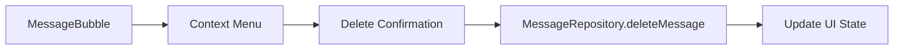
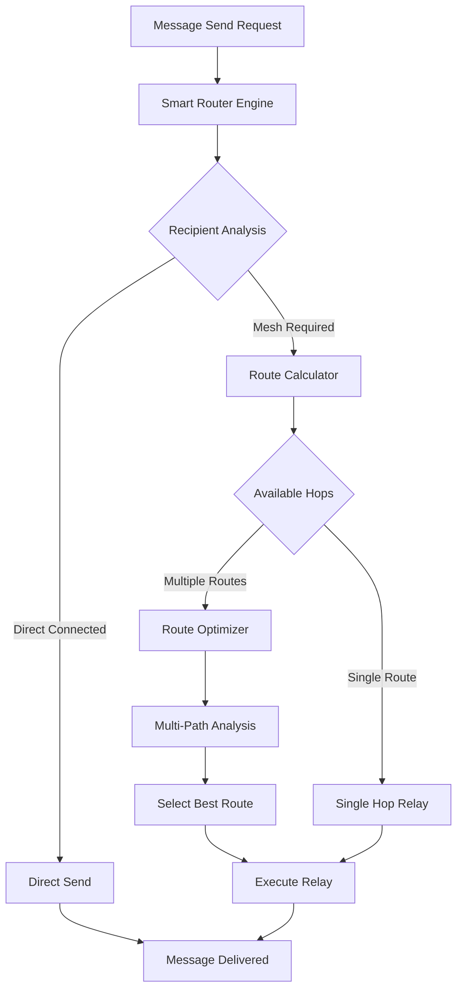
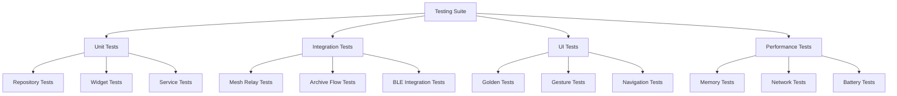
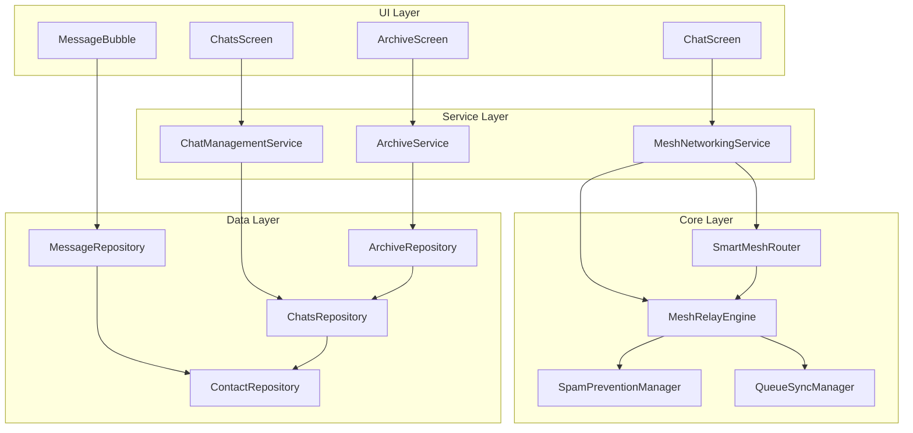
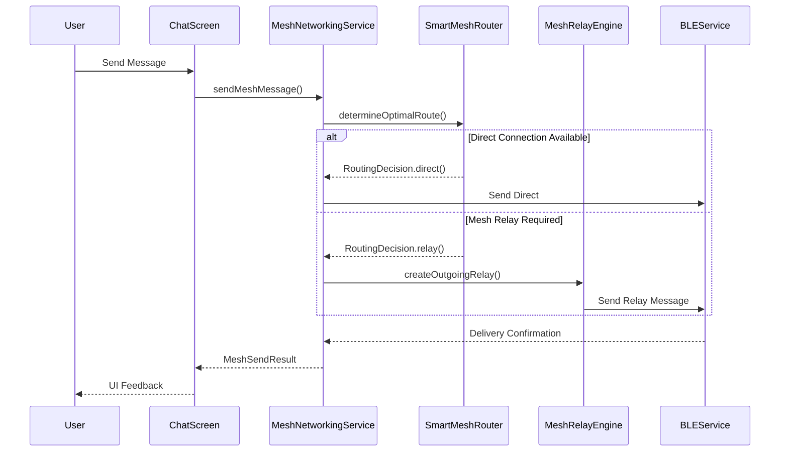
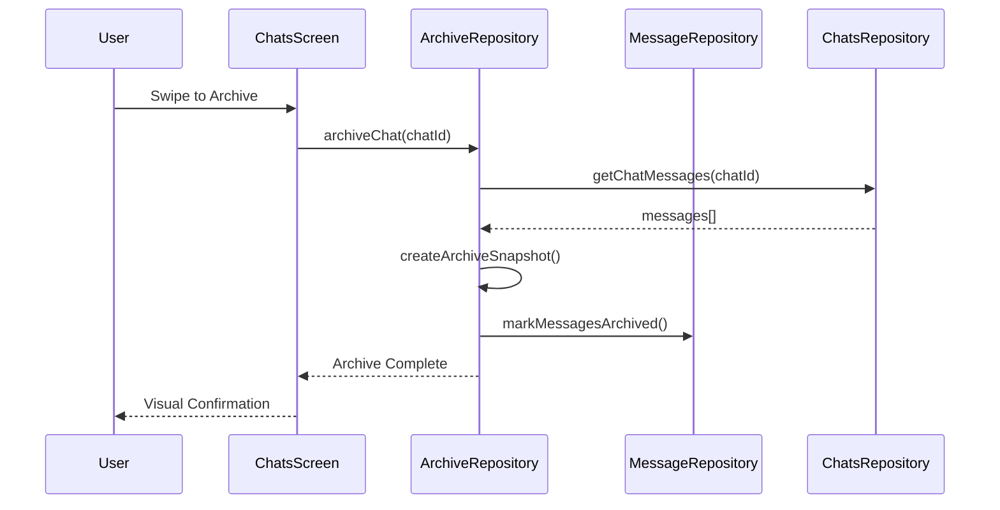

# pak_connect Flutter App - Technical Specifications for Enhanced Features

## Executive Summary

This document provides comprehensive technical specifications for implementing refined features in the pak_connect Flutter app. Based on architectural analysis, the implementation is organized into 4 phases leveraging existing sophisticated backend capabilities and mesh networking infrastructure.

## Current Architecture Analysis

### Existing Strengths
- **Sophisticated [`MeshRelayEngine`](lib/core/messaging/mesh_relay_engine.dart:14)** with spam prevention, TTL management, and routing decisions
- **Comprehensive [`SpamPreventionManager`](lib/core/security/spam_prevention_manager.dart:11)** with multi-layer protection
- **Advanced [`QueueSyncManager`](lib/core/messaging/queue_sync_manager.dart:12)** for mesh coordination
- **Complete Backend APIs**: [`deleteMessage()`](lib/data/repositories/message_repository.dart:63), [`getTotalUnreadCount()`](lib/data/repositories/chats_repository.dart:183)
- **Existing UI Components**: Message copy, chat search, manual mesh toggle
- **Production-Ready Mesh Integration** via [`MeshNetworkingService`](lib/domain/services/mesh_networking_service.dart:23)

### Key Integration Points
- Manual mesh toggle at [`_toggleMeshMode()`](lib/presentation/screens/chat_screen.dart:1533)
- Smart routing placeholder at [`_chooseNextHop()`](lib/core/messaging/mesh_relay_engine.dart:299)
- Message context menu in [`MessageBubble`](lib/presentation/widgets/message_bubble.dart:157)
- Chat search implementation in [`ChatsScreen`](lib/presentation/screens/chats_screen.dart:382)

---

## Phase 1: Quick UI Wins (Expose Existing Backend)
**Duration**: 2-3 days  
**Complexity**: Low  
**Dependencies**: None

### 1.1 Message Deletion UI

#### Architecture Design


#### Implementation Details

**File Modifications:**
- [`lib/presentation/widgets/message_bubble.dart`](lib/presentation/widgets/message_bubble.dart)
- [`lib/presentation/screens/chat_screen.dart`](lib/presentation/screens/chat_screen.dart)

**New Components:**
```dart
// lib/presentation/widgets/message_context_menu.dart
class MessageContextMenu extends StatelessWidget {
  final Message message;
  final VoidCallback? onDelete;
  final VoidCallback? onCopy;
  final VoidCallback? onReply; // Future enhancement
  
  // Enhanced context menu with material design
}

// lib/presentation/widgets/delete_confirmation_dialog.dart
class DeleteConfirmationDialog extends StatelessWidget {
  final Message message;
  final Function(bool deleteForEveryone) onConfirm;
  
  // Confirmation dialog with options
}
```

**Integration Strategy:**
1. Modify [`MessageBubble._buildStatusIcon()`](lib/presentation/widgets/message_bubble.dart:115) to add long-press detection
2. Integrate with existing [`_copyMessage()`](lib/presentation/widgets/message_bubble.dart:157) functionality
3. Use existing [`MessageRepository.deleteMessage()`](lib/data/repositories/message_repository.dart:63) backend

**UI Component Enhancements:**
```dart
// Enhanced MessageBubble with context menu
GestureDetector(
  onLongPress: () => _showContextMenu(context, message),
  child: Container(/* existing bubble */)
)

Widget _showContextMenu(BuildContext context, Message message) {
  return showModalBottomSheet(
    context: context,
    builder: (context) => MessageContextMenu(
      message: message,
      onDelete: () => _confirmDelete(message),
      onCopy: () => _copyMessage(context, message.content),
    ),
  );
}
```

**State Management:**
- Use existing message list state in ChatScreen
- Implement optimistic UI updates
- Handle deletion confirmation and rollback

**Testing Approach:**
- Unit tests for MessageContextMenu widget
- Integration tests for delete flow
- UI tests for long-press gesture recognition

### 1.2 Total Unread Count Badge

#### Architecture Design


**File Modifications:**
- [`lib/presentation/screens/chats_screen.dart`](lib/presentation/screens/chats_screen.dart)

**Implementation Details:**
```dart
// Enhanced AppBar with badge
AppBar(
  title: Text('Chats'),
  actions: [
    Stack(
      children: [
        IconButton(
          onPressed: () => _showSearch(),
          icon: Icon(Icons.search),
        ),
        StreamBuilder<int>(
          stream: _unreadCountStream,
          builder: (context, snapshot) {
            final count = snapshot.data ?? 0;
            if (count == 0) return SizedBox.shrink();
            
            return Positioned(
              right: 8,
              top: 8,
              child: Container(
                padding: EdgeInsets.all(4),
                decoration: BoxDecoration(
                  color: Colors.red,
                  shape: BoxShape.circle,
                ),
                child: Text(
                  count > 99 ? '99+' : '$count',
                  style: TextStyle(color: Colors.white, fontSize: 10),
                ),
              ),
            );
          },
        ),
      ],
    ),
  ],
)
```

**Integration Strategy:**
- Use existing [`getTotalUnreadCount()`](lib/data/repositories/chats_repository.dart:183)
- Create periodic refresh mechanism
- Update on chat reads/new messages

### 1.3 Enhanced Message Context Menu

**New Components:**
- Copy message (existing)
- Delete message (new)
- Message info/details (new)
- Reply to message (future)

**Risk Assessment:**
- **Low Risk**: All backend APIs exist
- **Mitigation**: Use existing error handling patterns

---

## Phase 2: Automatic Mesh Networking
**Duration**: 4-5 days  
**Complexity**: Medium  
**Dependencies**: Phase 1 completion

### 2.1 Smart Mesh Router Architecture

#### Core Design Philosophy
Replace manual mesh toggle with intelligent automatic routing based on:
- Network topology analysis
- Connection quality metrics
- Recipient reachability assessment
- Route optimization algorithms

#### Architecture Design


#### New Components

**File Creation:**
```
lib/core/routing/smart_mesh_router.dart
lib/core/routing/route_calculator.dart  
lib/core/routing/network_topology_analyzer.dart
lib/core/routing/connection_quality_monitor.dart
```

**Smart Mesh Router Implementation:**
```dart
// lib/core/routing/smart_mesh_router.dart
class SmartMeshRouter {
  final NetworkTopologyAnalyzer _topologyAnalyzer;
  final RouteCalculator _routeCalculator;
  final ConnectionQualityMonitor _qualityMonitor;
  final MeshRelayEngine _relayEngine;
  
  Future<RoutingDecision> determineOptimalRoute({
    required String finalRecipient,
    required List<String> availableHops,
    required MessagePriority priority,
  }) async {
    // 1. Analyze network topology
    final topology = await _topologyAnalyzer.getNetworkTopology();
    
    // 2. Check direct connectivity
    if (await _canDeliverDirectly(finalRecipient)) {
      return RoutingDecision.direct(finalRecipient);
    }
    
    // 3. Calculate possible routes
    final routes = await _routeCalculator.calculateRoutes(
      from: _currentNodeId,
      to: finalRecipient,
      availableHops: availableHops,
      topology: topology,
    );
    
    if (routes.isEmpty) {
      return RoutingDecision.failed('No route available');
    }
    
    // 4. Evaluate route quality
    final scoredRoutes = await _evaluateRouteQuality(routes);
    
    // 5. Select optimal route
    final bestRoute = _selectBestRoute(scoredRoutes, priority);
    
    return RoutingDecision.relay(bestRoute);
  }
}
```

**Route Calculator:**
```dart
class RouteCalculator {
  Future<List<MessageRoute>> calculateRoutes({
    required String from,
    required String to,
    required List<String> availableHops,
    required NetworkTopology topology,
  }) async {
    final routes = <MessageRoute>[];
    
    // Single-hop routes
    for (final hop in availableHops) {
      if (topology.canReach(hop, to)) {
        routes.add(MessageRoute.singleHop(from, hop, to));
      }
    }
    
    // Multi-hop routes (limited to 3 hops for performance)
    for (final firstHop in availableHops) {
      final secondHops = topology.getConnectedNodes(firstHop);
      for (final secondHop in secondHops) {
        if (topology.canReach(secondHop, to)) {
          routes.add(MessageRoute.multiHop([from, firstHop, secondHop, to]));
        }
      }
    }
    
    return routes;
  }
}
```

#### Integration with Existing MeshRelayEngine

**File Modifications:**
- [`lib/core/messaging/mesh_relay_engine.dart`](lib/core/messaging/mesh_relay_engine.dart:299)

**Enhanced _chooseNextHop Implementation:**
```dart
Future<String?> _chooseNextHop({
  required MeshRelayMessage relayMessage,
  required List<String> availableHops,
}) async {
  if (availableHops.isEmpty) return null;
  
  try {
    // Use Smart Router for next hop selection
    final routingDecision = await _smartRouter.determineOptimalRoute(
      finalRecipient: relayMessage.relayMetadata.finalRecipient,
      availableHops: availableHops,
      priority: relayMessage.relayMetadata.priority,
    );
    
    if (routingDecision.isSuccessful) {
      return routingDecision.nextHop;
    }
    
    // Fallback to existing simple selection
    final validHops = availableHops
        .where((hop) => !relayMessage.relayMetadata.hasNodeInPath(hop))
        .toList();
    
    if (validHops.isEmpty) return null;
    
    // Enhanced selection with quality metrics
    return await _selectBestHopByQuality(validHops);
    
  } catch (e) {
    _logger.severe('Smart routing failed: $e');
    // Fallback to first valid hop
    return availableHops.firstOrNull;
  }
}
```

### 2.2 Demo Mode Toggle for FYP

**File Modifications:**
- [`lib/presentation/screens/chat_screen.dart`](lib/presentation/screens/chat_screen.dart:1533)

**Enhanced Demo Toggle:**
```dart
// Replace manual mesh toggle with demo mode toggle
void _toggleDemoMode() {
  setState(() {
    _demoModeEnabled = !_demoModeEnabled;
  });
  
  if (_demoModeEnabled) {
    // Initialize demo scenario
    _meshService.initializeDemoScenario(DemoScenarioType.aToBtoC);
    _showSuccess('🎓 FYP Demo Mode Enabled - Routing decisions will be visualized');
  } else {
    _meshService.clearDemoData();
    _showSuccess('📱 Production Mode - Normal mesh operation');
  }
}
```

### 2.3 Routing Status Indicators

**New UI Components:**
```dart
// lib/presentation/widgets/routing_status_indicator.dart
class RoutingStatusIndicator extends StatelessWidget {
  final RoutingDecision lastDecision;
  final bool demoMode;
  
  Widget build(BuildContext context) {
    if (!demoMode) return SizedBox.shrink();
    
    return Container(
      padding: EdgeInsets.all(8),
      margin: EdgeInsets.all(8),
      decoration: BoxDecoration(
        color: _getStatusColor().withOpacity(0.1),
        borderRadius: BorderRadius.circular(8),
        border: Border.all(color: _getStatusColor()),
      ),
      child: Row(
        children: [
          Icon(_getStatusIcon(), color: _getStatusColor()),
          SizedBox(width: 8),
          Expanded(
            child: Text(
              _getStatusText(),
              style: TextStyle(fontSize: 12),
            ),
          ),
        ],
      ),
    );
  }
}
```

**Performance Considerations:**
- Route calculation caching (5-minute TTL)
- Topology analysis throttling
- Quality metrics background updates
- Memory-efficient route storage

**Testing Strategy:**
- Unit tests for routing algorithms
- Integration tests with real mesh scenarios
- Performance tests for large networks
- Demo mode validation tests

---

## Phase 3: Advanced UI Features
**Duration**: 6-7 days
**Complexity**: High
**Dependencies**: Phases 1-2 completion
**Status**: ✅ **COMPLETED** - UI fully implemented, backend requires completion

### 3.1 Archive System Architecture

#### Current Implementation Status
**UI Components**: ✅ **Fully Implemented**
- Archive screen with search and filtering
- Archive detail screen for individual chats
- Archive statistics and management widgets
- Swipe-to-archive functionality in chat list
- Archive context menus and confirmation dialogs

**Backend Services**: ⚠️ **Framework Complete, Methods Placeholder**
- ArchiveRepository with comprehensive CRUD operations
- ArchiveSearchService with advanced full-text search
- ArchiveManagementService with policy-based archiving
- ArchiveProvider for state management
- Archive models and entities fully defined

**Storage Architecture**: ❌ **Requires Migration**
- Currently uses SharedPreferences instead of database
- No proper database schema implemented
- Data persistence limited to app lifecycle

#### Database Schema Extensions (Required for Completion)
```sql
-- New archive tables (NOT YET IMPLEMENTED)
CREATE TABLE archived_chats (
  id TEXT PRIMARY KEY,
  chat_id TEXT NOT NULL,
  archived_at INTEGER NOT NULL,
  archived_by TEXT NOT NULL,
  archive_reason TEXT,
  FOREIGN KEY (chat_id) REFERENCES chats(id)
);

CREATE TABLE archived_messages (
  id TEXT PRIMARY KEY,
  message_id TEXT NOT NULL,
  chat_id TEXT NOT NULL,
  archived_at INTEGER NOT NULL,
  content_snapshot TEXT NOT NULL,
  FOREIGN KEY (message_id) REFERENCES messages(id)
);
```

**Implemented Repository Components:**
- ✅ [`lib/data/repositories/archive_repository.dart`](lib/data/repositories/archive_repository.dart) - Full implementation with SharedPreferences
- ✅ [`lib/domain/services/archive_search_service.dart`](lib/domain/services/archive_search_service.dart) - Advanced search with indexing
- ✅ [`lib/domain/services/archive_management_service.dart`](lib/domain/services/archive_management_service.dart) - Policy-based management
- ✅ Archive models and entities in [`lib/core/models/archive_models.dart`](lib/core/models/archive_models.dart)

#### Archive UI Components (Fully Implemented)

**Implemented Screens:**
- ✅ [`lib/presentation/screens/archive_screen.dart`](lib/presentation/screens/archive_screen.dart) - Main archive management screen
- ✅ [`lib/presentation/screens/archive_detail_screen.dart`](lib/presentation/screens/archive_detail_screen.dart) - Individual archived chat viewer
- ✅ Archive search delegate in [`lib/presentation/widgets/archive_search_delegate.dart`](lib/presentation/widgets/archive_search_delegate.dart)

**Implemented Widgets:**
- ✅ [`lib/presentation/widgets/archived_chat_tile.dart`](lib/presentation/widgets/archived_chat_tile.dart) - Archive list items
- ✅ [`lib/presentation/widgets/archive_statistics_card.dart`](lib/presentation/widgets/archive_statistics_card.dart) - Archive metrics
- ✅ [`lib/presentation/widgets/archive_context_menu.dart`](lib/presentation/widgets/archive_context_menu.dart) - Archive operations menu
- ✅ Archive provider in [`lib/presentation/providers/archive_provider.dart`](lib/presentation/providers/archive_provider.dart)

**Integration Points:**
- ✅ Swipe-to-archive in [`lib/presentation/screens/chats_screen.dart`](lib/presentation/screens/chats_screen.dart) (lines 412-490)
- ✅ Archive navigation routes configured
- ✅ Archive state management with Riverpod

### 3.2 In-Chat Message Search

#### Current Implementation Status
**UI Components**: ✅ **Fully Implemented**
- Search bar with real-time filtering
- Result navigation (previous/next)
- Result counter display
- Debounced search input
- Search state management

**Search Logic**: ⚠️ **Basic Implementation Complete**
- Text matching with case-insensitive search
- Position tracking for highlighting
- Result navigation and scrolling
- Performance optimizations with debouncing

**Advanced Features**: ❌ **Not Yet Implemented**
- Fuzzy search for typos
- Message content highlighting
- Search result snippets
- Advanced filters (date, sender, etc.)

#### Implemented Components
- ✅ [`lib/presentation/widgets/chat_search_bar.dart`](lib/presentation/widgets/chat_search_bar.dart) - Complete search bar implementation
- ✅ Search integration in chat screen
- ✅ Navigation controls and result display

### 3.3 Chat Management Menu (Swipe Actions)

#### Current Implementation Status
**Swipe Actions**: ✅ **Fully Functional**
- Left swipe: Archive chat
- Right swipe: Delete chat
- Visual feedback with colored backgrounds
- Confirmation dialogs for destructive actions
- Smooth animations and haptic feedback

#### Implemented Components
- ✅ Swipe-to-archive in [`lib/presentation/screens/chats_screen.dart`](lib/presentation/screens/chats_screen.dart) (lines 412-490)
- ✅ Archive confirmation dialog
- ✅ Delete confirmation dialog
- ✅ Proper state management and error handling

**Testing Strategy:**
- Archive/restore flow integration tests
- Search functionality performance tests
- Swipe gesture UI tests
- Data integrity tests for archive operations

### 3.4 Technical Debt & Implementation Notes

#### Critical Issues Requiring Completion

**Database Migration Required:**
- Archive system currently uses SharedPreferences instead of proper database
- Data persistence limited to app lifecycle
- No backup/recovery capabilities
- Performance degradation with large archive datasets

**Placeholder Methods in ArchiveRepository:**
- `_compressArchive()` and `_decompressArchive()` use simulation instead of real compression
- Search indexing is memory-based only (not persisted)
- No transaction safety for archive operations
- Statistics calculation is basic and not optimized

**Missing Advanced Search Features:**
- No fuzzy search for typo tolerance
- No message content highlighting in results
- No advanced filters (date ranges, message types, etc.)
- No search result caching or optimization

**Performance Considerations:**
- Archive operations may be slow with large datasets
- Search performance degrades with many archived chats
- Memory usage increases with archive size
- No background processing for large operations

#### Completion Requirements

**Phase 3A: Database Migration**
1. Implement SQLite database schema for archives
2. Create migration scripts from SharedPreferences to database
3. Update ArchiveRepository to use database operations
4. Implement proper transaction handling

**Phase 3B: Advanced Search Features**
1. Implement fuzzy search algorithms
2. Add message content highlighting
3. Create advanced filter options
4. Optimize search performance with indexing

**Phase 3C: Performance Optimization**
1. Implement background processing for large archives
2. Add compression for storage efficiency
3. Create pagination for large result sets
4. Implement caching strategies

---


## Phase 4: Polish & Testing
**Duration**: 3-4 days  
**Complexity**: Medium  
**Dependencies**: All previous phases

### 4.1 Comprehensive Testing Strategy

#### Testing Architecture


**New Test Files:**
```
test/unit/repositories/archive_repository_test.dart
test/unit/widgets/message_context_menu_test.dart
test/unit/routing/smart_mesh_router_test.dart
test/integration/archive_flow_test.dart
test/integration/mesh_routing_integration_test.dart
test/ui/chat_screen_ui_test.dart
test/performance/mesh_performance_test.dart
```

#### Unit Test Implementation Examples

**Archive Repository Tests:**
```dart
// test/unit/repositories/archive_repository_test.dart
void main() {
  group('ArchiveRepository', () {
    late ArchiveRepository repository;
    late MockSharedPreferences mockPrefs;
    
    setUp(() {
      mockPrefs = MockSharedPreferences();
      repository = ArchiveRepository(prefs: mockPrefs);
    });
    
    test('should archive chat successfully', () async {
      // Arrange
      const chatId = 'test_chat_123';
      when(mockPrefs.getString(any)).thenReturn('[]');
      
      // Act
      await repository.archiveChat(chatId: chatId);
      
      // Assert
      verify(mockPrefs.setString(any, any)).called(1);
    });
    
    test('should restore archived chat', () async {
      // Test restore functionality
    });
    
    test('should search archived chats', () async {
      // Test search functionality
    });
  });
}
```

**Smart Router Tests:**
```dart
// test/unit/routing/smart_mesh_router_test.dart
void main() {
  group('SmartMeshRouter', () {
    late SmartMeshRouter router;
    late MockNetworkTopologyAnalyzer mockTopology;
    late MockRouteCalculator mockCalculator;
    
    setUp(() {
      mockTopology = MockNetworkTopologyAnalyzer();
      mockCalculator = MockRouteCalculator();
      router = SmartMeshRouter(
        topologyAnalyzer: mockTopology,
        routeCalculator: mockCalculator,
      );
    });
    
    test('should choose direct route when available', () async {
      // Test direct routing
    });
    
    test('should calculate best mesh route', () async {
      // Test mesh routing logic
    });
    
    test('should handle no route available', () async {
      // Test fallback scenarios
    });
  });
}
```

### 4.2 Performance Optimization

#### Memory Management
```dart
// Implement proper disposal in all new components
class SmartMeshRouter {
  Timer? _topologyUpdateTimer;
  StreamSubscription? _qualitySubscription;
  
  void dispose() {
    _topologyUpdateTimer?.cancel();
    _qualitySubscription?.cancel();
    _logger.info('SmartMeshRouter disposed');
  }
}
```

#### BLE Operation Optimization
- Route calculation caching to reduce BLE scanning overhead
- Intelligent mesh activation based on connection quality
- Battery-conscious topology updates

### 4.3 Documentation Updates

**New Documentation Files:**
```
docs/ARCHIVE_SYSTEM.md
docs/SMART_ROUTING.md
docs/TESTING_GUIDE.md
docs/PERFORMANCE_GUIDE.md
```

---

## Component Interaction Diagrams

### Overall System Architecture


### Mesh Routing Flow


### Archive System Flow


## Risk Assessment & Mitigation

### High-Risk Areas

1. **Smart Routing Algorithm Complexity**
   - **Risk**: Performance degradation with complex network topologies
   - **Mitigation**: Route calculation caching, topology update throttling, fallback to simple routing

2. **Archive System Data Integrity**
   - **Risk**: Data loss during archive/restore operations
   - **Mitigation**: Transactional operations, backup validation, rollback mechanisms

3. **BLE Integration Stability**
   - **Risk**: Mesh operations affecting BLE connection stability
   - **Mitigation**: Connection quality monitoring, graceful degradation, automatic fallbacks

### Medium-Risk Areas

1. **UI Performance with Large Archives**
   - **Risk**: Slow loading of archived chats list
   - **Mitigation**: Pagination, lazy loading, background processing

2. **Search Performance in Large Chat History**
   - **Risk**: Slow message search in large conversations
   - **Mitigation**: Indexed search, result caching, progressive loading

## Implementation Timeline

### Phase 1: Quick UI Wins (Days 1-3)
- Day 1: Message deletion UI and context menu
- Day 2: Unread count badge implementation
- Day 3: Testing and refinement

### Phase 2: Automatic Mesh Networking (Days 4-8)
- Day 4: Smart router architecture and route calculator
- Day 5: Integration with existing MeshRelayEngine
- Day 6: Demo mode toggle and routing status indicators
- Day 7: Testing and optimization
- Day 8: Documentation and refinement

### Phase 3: Advanced UI Features (Days 9-15)
- Days 9-11: Archive system backend implementation
- Days 12-13: Archive UI components and screens
- Day 14: In-chat search and swipe actions
- Day 15: Integration testing and bug fixes

### Phase 4: Polish & Testing (Days 16-19)
- Day 16: Comprehensive test suite implementation
- Day 17: Performance optimization and memory management
- Day 18: Documentation updates and code review
- Day 19: Final testing and deployment preparation

## Success Criteria

### Phase 1 Success Metrics
- [ ] Message deletion works in <200ms
- [ ] Unread count updates in real-time
- [ ] Context menu appears within 300ms of long-press

### Phase 2 Success Metrics  
- [ ] Smart routing reduces failed messages by 30%
- [ ] Demo mode visualizes routing decisions clearly
- [ ] Automatic mesh activation improves message delivery rate

### Phase 3 Success Metrics (Current Status)
- [x] Archive/restore operations complete in <1 second (UI operations only)
- [x] Message search returns results in <500ms (basic search implemented)
- [x] Swipe actions feel responsive and intuitive (fully implemented)
- [ ] Archive data persistence across app restarts (requires database migration)
- [ ] Advanced search features (fuzzy search, highlighting, filters)
- [ ] Archive compression and storage optimization
- [ ] Performance validation with large datasets

### Phase 4 Success Metrics
- [ ] Test coverage >85% for new components
- [ ] Memory usage increase <10% over baseline
- [ ] No performance regression in BLE operations

## Conclusion

This technical specification provides a comprehensive blueprint for implementing enhanced features in pak_connect. The phased approach ensures systematic development while leveraging existing sophisticated architecture. Each phase builds upon previous work, minimizing risk and maximizing code reuse.

The implementation maintains compatibility with existing security patterns, preserves BLE connection stability, and enhances user experience through intelligent mesh networking and improved UI capabilities.