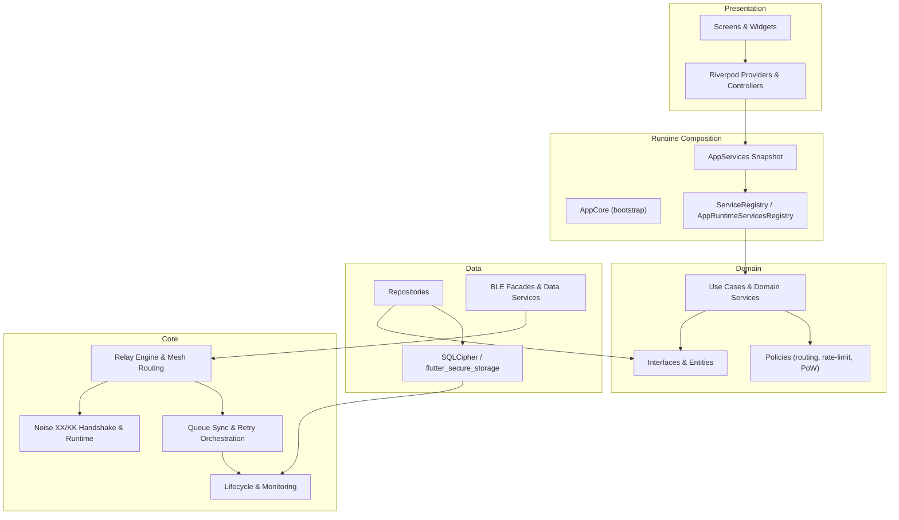

# PakConnect

[](https://flutter.dev)
[](https://dart.dev)
[](https://riverpod.dev)
[](https://noiseprotocol.org)
[](https://www.zetetic.net/sqlcipher/)
[]()

Secure peer-to-peer messaging over Bluetooth Low Energy for off-grid environments. PakConnect combines dual-role BLE discovery, end-to-end encrypted messaging, store-and-forward queues, mesh relay forwarding, and relay metadata privacy in a Flutter application designed for hostile or connectivity-constrained conditions.

---

## Highlights

- End-to-end encrypted messaging using Noise XX/KK, X25519, and ChaCha20-Poly1305.
- Dual-role BLE runtime operating as central and peripheral simultaneously.
- Offline-first delivery with queue sync, retry orchestration, and relay-aware routing.
- Mesh relay with multi-hop message forwarding and store-and-forward for offline recipients.
- Stealth addressing (EIP-5564 simplified) for relay metadata privacy.
- Sealed sender — relay nodes cannot observe message origin.
- Hashcash proof-of-work spam prevention with trust-tiered rate limits.
- Broadcast mode for small networks of up to 30 peers.
- Rich messaging: text, binary payloads, archive/search, groups, and topology views.
- Export/import with HMAC-SHA256 authenticated v2 bundles containing an embedded encrypted database.
- Custom `ServiceRegistry` + `AppRuntimeServicesRegistry` for dependency injection with no GetIt dependency.
- CI-enforced coverage via `flutter_coverage.yml` and static analysis via `codeql.yml`.

---

## Current Status

PakConnect is in active hardening and release-preparation. Core transport, persistence, archive/search, and advanced UI flows are implemented. VM-friendly `flutter test` coverage is green and enforced in CI. Current work is focused on release validation and documentation.

---

## Architecture

PakConnect follows a layered architecture with a single runtime composition root. `AppCore` bootstraps all services and publishes a typed `AppServices` snapshot that propagates upward through Riverpod providers to the presentation layer.



### Tech Stack

| Layer | Libraries |
|---|---|
| Framework | Flutter 3.9+ / Dart 3.9+ |
| State | Riverpod 3.0 |
| BLE | `bluetooth_low_energy` |
| Persistence | `sqflite_sqlcipher`, `flutter_secure_storage` |
| Cryptography | `pinenacl`, `cryptography`, `pointycastle` |

---

## Key Security Features

### Noise XX/KK Protocol

All peer-to-peer communication uses the [Noise Protocol Framework](https://noiseprotocol.org). XX is used for initial mutual authentication with no prior key knowledge; KK is used for subsequent sessions where both static keys are already known. Key agreement is X25519; transport encryption is ChaCha20-Poly1305.

### Stealth Addressing

Relay metadata privacy is implemented using a simplified variant of EIP-5564 stealth addressing. Recipients publish a stealth meta-address; senders derive a one-time relay address per message. Relay nodes see neither the true sender identity nor the true recipient identity.

### Sealed Sender

Message origin is concealed from relay nodes. Only the intended recipient can recover the sender's identity. Intermediate relay hops forward ciphertext without access to authorship information.

### Proof-of-Work Spam Prevention

Outbound messages include a Hashcash-style proof-of-work token. Required difficulty scales with trust tier, making spam and denial-of-service attacks computationally expensive without degrading legitimate low-volume usage.

### Export/Import Security

Data exports are packaged as HMAC-SHA256 authenticated v2 bundles. The bundle embeds an encrypted copy of the database. Import validates the authentication tag before any data is read or written.

### Fail-Closed Encryption

Database encryption is designed to fail closed when secure storage is unavailable — the application will not fall back to plaintext persistence. New outbound transport is also fail-closed. Decryption compatibility for migration scenarios is limited to inbound legacy paths and does not affect new message handling.

---

## Repository Layout

```text
lib/
  core/           infrastructure, security, BLE runtime, mesh routing
  data/           repositories, database, BLE/data services
  domain/         interfaces, entities, use cases, policies
  presentation/   screens, widgets, providers, controllers

test/             unit and widget suites mirroring lib/
integration_test/ device-bound integration and soak scenarios
docs/             security, testing, refactoring, and SRS material
```

---

## Getting Started

### Prerequisites

- Flutter SDK 3.9+
- Dart SDK 3.9+ (bundled with Flutter)
- Android or iOS hardware for BLE validation (emulators do not support BLE)
- Android Studio or VS Code with the Flutter plugin

### Clone and Install

```bash
git clone https://github.com/AbubakarMahmood1/pak_connect_final.git
cd pak_connect_final
flutter pub get
```

### Run

```bash
flutter run
```

### Analyze

```bash
flutter analyze --no-pub
```

### Test

```bash
flutter test
```

For full-suite output with coverage:

```bash
set -o pipefail
flutter test --coverage | tee flutter_test_latest.log
```

Integration tests require a physical device:

```bash
flutter test integration_test/
```

---

## Documentation

| Document | Description |
|---|---|
| [Threat Model](ThreatModel.md) | Attacker model, trust boundaries, and mitigations |
| [Security Guarantees](docs/security/security_guarantees.md) | Implemented cryptographic and operational guarantees |
| [DI Unification Roadmap](docs/refactoring/DI_UNIFICATION_ROADMAP.md) | ServiceRegistry migration and DI consolidation plan |
| [Testing Strategy](TESTING_STRATEGY.md) | Test philosophy, coverage policy, and CI integration |
| [Testing Quick Start](docs/testing/QUICK_START_TESTING.md) | How to run tests locally and interpret results |
| [SRS Overview](docs/srs/README.md) | Software requirements specification index |

---

## Security Notes

- The threat model and security guarantees documents are the authoritative source of truth for security properties. Historical audit notes may be outdated.
- `lib/core/security/`, BLE lifecycle code, and mesh routing code are high-scrutiny areas. Changes to these paths require careful review and test coverage.
- Relay nodes are explicitly untrusted. Stealth addressing and sealed sender are both required for metadata privacy; neither alone is sufficient.
- Do not remove or weaken proof-of-work enforcement without a documented risk assessment.

---

## Contribution Expectations

This is a proprietary internal repository.

- Keep architecture layer boundaries intact. Domain code must not import from data or presentation. Core must not import from domain.
- Use structured logging throughout; `print()` statements are not acceptable in runtime code.
- Add or update tests alongside all functional changes. Coverage enforcement is automated in CI.
- Changes to security-critical paths (`core/security/`, relay engine, routing, queue sync) require explicit justification and a corresponding test demonstrating the invariant being preserved.
- The `ServiceRegistry` and `AppRuntimeServicesRegistry` are the canonical DI mechanism. Do not reintroduce GetIt or ad-hoc service locators.

---

## License

Proprietary. All rights reserved.
