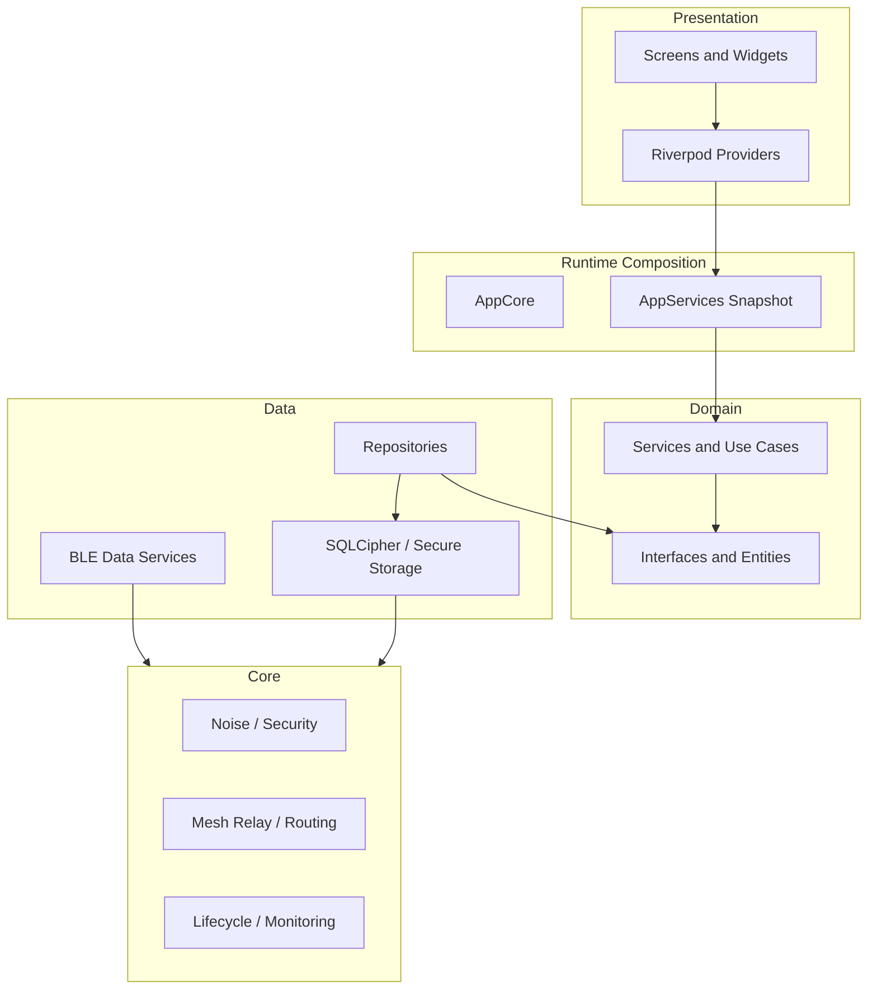

# PakConnect

[](https://flutter.dev)
[](https://dart.dev)
[](https://riverpod.dev)
[](https://noiseprotocol.org)
[](https://www.zetetic.net/sqlcipher/)
[]()

Secure peer-to-peer messaging over Bluetooth Low Energy for off-grid environments. PakConnect combines BLE discovery, dual-role transport, end-to-end encrypted messaging, store-and-forward queues, and mesh relay logic in a Flutter application built for hostile or connectivity-constrained conditions.

## Highlights

- End-to-end encrypted messaging using Noise XX/KK, X25519, and ChaCha20-Poly1305.
- Mobile database encryption at rest using SQLCipher-backed storage.
- Dual-role BLE runtime that can operate as both central and peripheral.
- Offline-first delivery with queue sync, retry orchestration, and relay-aware routing.
- Rich messaging flows including text, binary payloads, archive/search, groups, and topology views.
- Large automated test surface with CI guardrails for runtime hygiene, DI boundaries, and crypto policy regressions.

## Current Status

PakConnect is in active hardening and release-preparation, not an early feature-build phase.

- Core transport, persistence, archive/search, and advanced UI flows are implemented.
- VM-friendly `flutter test` coverage is green and enforced in CI.
- Current work is focused on legacy compatibility retirement, DI consolidation, runtime hardening, and release validation.

## Architecture

PakConnect follows a layered architecture with an explicit runtime composition root.



### Main Runtime Pieces

- Presentation: Flutter widgets with Riverpod-managed UI state.
- Runtime composition: `AppCore` bootstraps the app and publishes a typed `AppServices` snapshot.
- Data layer: repositories, BLE facades, SQLite/SQLCipher persistence, secure storage.
- Core layer: Noise handshake/runtime, relay engine, routing, queue sync, and monitoring.

### Tech Stack

- Flutter 3.9+ / Dart 3.9+
- Riverpod 3.0
- `bluetooth_low_energy`
- `sqflite_sqlcipher` + `flutter_secure_storage`
- `pinenacl`, `cryptography`, `pointycastle`

## Repository Layout

```text
lib/
  core/           infrastructure, security, BLE runtime, mesh routing
  data/           repositories, database, BLE/data services
  domain/         interfaces, entities, use cases, policies
  presentation/   screens, widgets, providers, controllers

test/             unit and widget suites mirroring lib/
integration_test/ device-bound integration and soak scenarios
docs/             security, testing, refactoring, review, and SRS material
```

## Getting Started

### Prerequisites

- Flutter SDK 3.9+
- Dart SDK 3.9+ (via Flutter)
- Android/iOS hardware for BLE validation
- Android Studio or VS Code

### Clone and Install

```bash
git clone https://github.com/AbubakarMahmood1/pak_connect_final.git
cd pak_connect_final
flutter pub get
```

### Run

```bash
flutter run
```

### Analyze

```bash
flutter analyze --no-pub
```

### Test

```bash
flutter test
```

For full-suite logging:

```bash
set -o pipefail
flutter test --coverage | tee flutter_test_latest.log
```

## Security Notes

- Mobile database encryption is intended to fail closed if secure storage is unavailable.
- Legacy decrypt compatibility still exists for migration scenarios; new outbound transport is fail-closed.
- Threat modeling and implemented guarantees are documented separately and should be treated as the source of truth over historical audit notes.

## Documentation

- [Testing Strategy](TESTING_STRATEGY.md)
- [Testing Quick Start](docs/testing/QUICK_START_TESTING.md)
- [Security Guarantees](docs/security/security_guarantees.md)
- [Threat Model](ThreatModel.md)
- [DI Unification Roadmap](docs/refactoring/DI_UNIFICATION_ROADMAP.md)
- [SRS Overview](docs/srs/README.md)
- [AI Agent Guidance](AGENTS.md)

## Contribution Expectations

This is a proprietary internal repository.

- Keep architecture boundaries intact.
- Avoid `print()` in runtime code; use structured logging.
- Add or update tests alongside functional changes.
- Treat `lib/core/security/`, BLE lifecycle code, and mesh routing code as high-scrutiny areas.

## License

Proprietary. All rights reserved.
