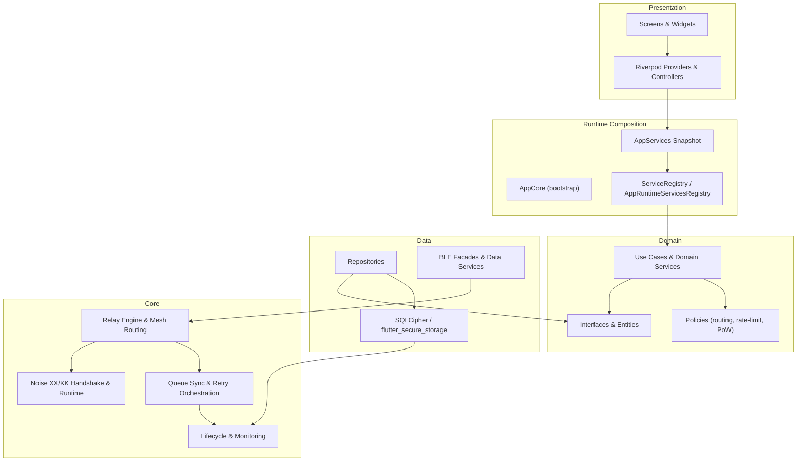

# PakConnect

[](https://flutter.dev)
[](https://dart.dev)
[](https://riverpod.dev)
[](https://noiseprotocol.org)
[](https://www.zetetic.net/sqlcipher/)
[]()

Secure peer-to-peer messaging over Bluetooth Low Energy for off-grid environments. PakConnect combines dual-role BLE discovery, end-to-end encrypted messaging, store-and-forward queues, and mesh relay forwarding in a Flutter application designed for hostile or connectivity-constrained conditions.

---

## Highlights

- End-to-end encrypted messaging using Noise XX/KK, X25519, and ChaCha20-Poly1305.
- Dual-role BLE runtime operating as central and peripheral simultaneously.
- Offline-first delivery with queue sync, retry orchestration, and relay-aware routing.
- Mesh relay with multi-hop message forwarding and store-and-forward for offline recipients.
- Stealth-addressing, sealed-sender, and Hashcash policy primitives are present,
  but are not enabled as production relay guarantees yet.
- Broadcast mode for small networks of up to 30 peers.
- Rich messaging: text, binary payloads, archive/search, sender-local broadcast
  lists, and topology views. Broadcast recipients receive ordinary direct
  messages; PakConnect does not currently implement a shared group protocol.
- Export/import with HMAC-SHA256 authenticated v2 bundles containing an embedded encrypted database.
- Custom `ServiceRegistry` + `AppRuntimeServicesRegistry` for dependency injection with no GetIt dependency.
- CI analysis/test workflows with coverage artifact generation; a numeric
  coverage threshold is not currently enforced.

---

## Current Status

PakConnect is in active hardening and release-preparation. Core transport,
persistence, archive/search, and advanced UI flows are implemented. The
VM-friendly test suite has a current clean local baseline; device transport,
mobile SQLCipher, and release-build evidence remain explicit validation gates.

---

## Architecture

PakConnect follows a layered architecture with a single runtime composition root. `AppCore` bootstraps all services and publishes a typed `AppServices` snapshot that propagates upward through Riverpod providers to the presentation layer.


```mermaid
graph TD
    subgraph Presentation["Presentation"]
        UI["Screens & Widgets"]
        RP["Riverpod Providers & Controllers"]
    end

    subgraph Composition["Runtime Composition"]
        AC["AppCore (bootstrap)"]
        AS["AppServices Snapshot"]
        SR["ServiceRegistry / AppRuntimeServicesRegistry"]
    end

    subgraph Domain["Domain"]
        UC["Use Cases & Domain Services"]
        IF["Interfaces & Entities"]
        PO["Policies (routing, rate-limit, PoW)"]
    end

    subgraph Data["Data"]
        REPO["Repositories"]
        DB["SQLCipher / flutter_secure_storage"]
        BLEF["BLE Facades & Data Services"]
    end

    subgraph Core["Core"]
        NOISE["Noise XX/KK Handshake & Runtime"]
        RELAY["Relay Engine & Mesh Routing"]
        QUEUE["Queue Sync & Retry Orchestration"]
        MON["Lifecycle & Monitoring"]
    end

    UI --> RP
    RP --> AS
    AS --> SR
    SR --> UC
    UC --> IF
    UC --> PO
    REPO --> IF
    REPO --> DB
    BLEF --> RELAY
    RELAY --> NOISE
    RELAY --> QUEUE
    DB --> MON
    QUEUE --> MON
```

### Tech Stack

| Layer | Libraries |
|---|---|
| Framework | Flutter 3.9+ / Dart 3.9+ |
| State | Riverpod 3.0 |
| BLE | `bluetooth_low_energy` |
| Persistence | `sqflite_sqlcipher`, `flutter_secure_storage` |
| Cryptography | `pinenacl`, `cryptography`, `pointycastle` |

---

## Key Security Features

### Noise XX/KK Protocol

End-to-end user payload encryption uses the
[Noise Protocol Framework](https://noiseprotocol.org). XX is used for initial
mutual authentication with no prior key knowledge; KK is used for subsequent
sessions where both static keys are already known. Key agreement is X25519;
transport encryption is ChaCha20-Poly1305. Protocol control metadata must be
assessed separately and is not covered by this payload-confidentiality claim.

### Relay Metadata Privacy Primitives

The codebase contains stealth-address and sealed-sender models and tests. The
live outgoing relay path does not currently generate stealth envelopes and
leaves sealed sender disabled, so intermediate relays can observe routing
aliases. Metadata anonymity is not a current product guarantee.

### Spam-Prevention Policy

Trust-tier rate limiting and Hashcash cost-policy primitives are implemented and
tested. Production composition currently injects no `MessageCostPolicy`, so
proof-of-work is not enforced on live outgoing or incoming relay traffic.

### Export/Import Security

Data exports are packaged as HMAC-SHA256 authenticated v2 bundles. The bundle embeds an encrypted copy of the database. Import validates the authentication tag before any data is read or written.

### Fail-Closed Encryption

On Android/iOS, database initialization requires the random SQLCipher credential
held in platform secure storage and fails closed if it cannot be obtained.
Desktop/test execution may use plaintext SQLite and is not mobile-encryption
evidence. New outbound encrypted transport rejects removed legacy modes;
`SimpleCrypto` compatibility naming does not enable a legacy decrypt lane.

---

## Repository Layout

```text
lib/
  core/           infrastructure, security, BLE runtime, mesh routing
  data/           repositories, database, BLE/data services
  domain/         interfaces, entities, use cases, policies
  presentation/   screens, widgets, providers, controllers

test/             VM-friendly unit, service, integration-style, and widget suites
integration_test/ device-bound SQLCipher validation
docs/             security, testing, refactoring, and SRS material
```

---

## Getting Started

### Prerequisites

- Flutter SDK 3.9+
- Dart SDK 3.9+ (bundled with Flutter)
- Android or iOS hardware for BLE validation (emulators do not support BLE)
- Android Studio or VS Code with the Flutter plugin

### Clone and Install

```bash
git clone https://github.com/AbubakarMahmood/pak_connect.git
cd pak_connect
flutter pub get
```

### Run

```bash
flutter run
```

### Analyze

```bash
flutter analyze --no-pub
```

### Test

```bash
flutter test
```

For full-suite output with coverage:

```bash
set -o pipefail
flutter test --coverage | tee flutter_test_latest.log
```

Integration tests require a physical device:

```bash
flutter test integration_test/ -d <android-or-ios-device-id>
```

The GitHub Actions test workflow runs `flutter test --coverage` and uploads the
LCOV file and logs. It does not run `integration_test/`, and it does not enforce
a numeric coverage threshold. Analyzer failures are fatal on `release/**`
branches; the regular-branch analyzer step is currently non-fatal.

---

## Documentation

| Document | Description |
|---|---|
| [Threat Model](ThreatModel.md) | Attacker model, trust boundaries, and mitigations |
| [Security Guarantees](docs/security/security_guarantees.md) | Implemented cryptographic and operational guarantees |
| [DI Unification Roadmap](docs/refactoring/DI_UNIFICATION_ROADMAP.md) | ServiceRegistry migration and DI consolidation plan |
| [Testing Strategy](TESTING_STRATEGY.md) | Test philosophy, coverage policy, and CI integration |
| [Testing Quick Start](docs/testing/QUICK_START_TESTING.md) | How to run tests locally and interpret results |
| [Readiness Audit](docs/status/READINESS_AUDIT.md) | Requirement-by-requirement evidence, verdict, risks, and next gate |
| [SRS Overview](docs/srs/README.md) | Software requirements specification index |

---

## Security Notes

- The threat model and security guarantees documents are the authoritative source of truth for security properties. Historical audit notes may be outdated.
- `lib/core/security/`, BLE lifecycle code, and mesh routing code are high-scrutiny areas. Changes to these paths require careful review and test coverage.
- Relay nodes are explicitly untrusted. The current runtime encrypts inner
  payloads but does not guarantee sender/recipient metadata anonymity.
- Sealed sender, stealth routing, or proof-of-work must be activated only through
  an explicit policy with interoperability, abuse, performance, and device
  evidence; do not advertise them as enabled before that gate passes.

---

## Contribution Expectations

This is a proprietary internal repository.

- Keep architecture layer boundaries intact. Domain code stays independent of
  core/data/presentation; core may consume domain contracts but not data or
  presentation; data must not import presentation.
- Use structured logging throughout; `print()` statements are not acceptable in runtime code.
- Add or update tests alongside all functional changes. CI generates and
  uploads coverage evidence, but coverage targets are review policy until a
  numeric regression gate is added.
- Changes to security-critical paths (`core/security/`, relay engine, routing, queue sync) require explicit justification and a corresponding test demonstrating the invariant being preserved.
- The `ServiceRegistry` and `AppRuntimeServicesRegistry` are the canonical DI mechanism. Do not reintroduce GetIt or ad-hoc service locators.

---

## License

Proprietary. All rights reserved.
