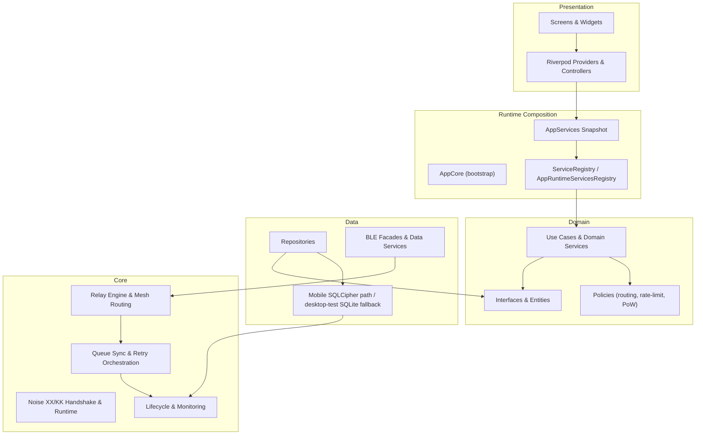

# PakConnect

[](https://flutter.dev)
[](https://dart.dev)
[](https://riverpod.dev)
[](https://noiseprotocol.org)
[](https://www.zetetic.net/sqlcipher/)
[](https://github.com/AbubakarMahmood/pak_connect/actions/workflows/flutter_coverage.yml)


Secure peer-to-peer messaging over Bluetooth Low Energy for off-grid environments. PakConnect combines a central/peripheral BLE architecture, end-to-end encrypted messaging, store-and-forward queues, and mesh relay forwarding in a Flutter application designed for hostile or connectivity-constrained conditions.

---

## Highlights

- Direct/session messaging uses Noise XX/KK, X25519, and
  ChaCha20-Poly1305; offline relay uses a signed encrypted v2 `sealed_v1`
  inner payload when recipient static key material is available.
- Central/peripheral BLE runtime paths are wired; simultaneous physical-radio
  behavior remains a two-device validation gate.
- Offline-first delivery with queue sync, retry orchestration, and relay-aware routing.
- Mesh relay code supports multi-hop forwarding and store-and-forward for
  offline recipients; automated regressions cover the logic, while physical
  `A -> B -> C` evidence still requires three Android devices.
- Stealth-addressing, sealed-sender, and Hashcash policy primitives are present,
  but are not enabled as production relay guarantees yet.
- Rich messaging: text, binary payloads, archive/search, sender-local broadcast
  lists, and topology views. Broadcast recipients receive ordinary direct
  messages; PakConnect does not currently implement a shared group protocol.
- Export/import with AES-256-GCM encrypted, HMAC-SHA256 authenticated v2.1
  bundles containing encrypted metadata, keys, preferences, and database bytes.
- Custom `ServiceRegistry` + `AppRuntimeServicesRegistry` for dependency injection with no GetIt dependency.
- CI analysis/test workflows with coverage artifact generation; a numeric
  coverage threshold is not currently enforced.

---

## Current Status

PakConnect is in active hardening and release-preparation. Core transport,
persistence, archive/search, and advanced UI flows are implemented. The
VM-friendly test suite has a current clean local baseline; device transport,
mobile SQLCipher, and release-build evidence remain explicit validation gates.
The current verified local runtime/device baseline is
`9434384851298c976cda0269f6cef65ebaafed1c` (`9434384`) on
`codex/archive-delete-contract`. It was verified with Flutter 3.44.4 revision
`ad70ec4617166f1c38e5d2bfd388af71fda14f06` and bundled Dart 3.12.2; the
project's Dart language floor remains 3.10.3.

| Local baseline evidence | Result |
|---|---|
| Full VM-friendly coverage run | 5,691 tests passed, 0 failed; reporter 5m37s; measured command wall 353,083 ms |
| `flutter_test_latest.log` | 9,268,167 bytes; SHA-256 `78798AD4575FB77E3B99F50C5D30B4715CE44CAA9BDC5245982CAF5F3892C905` |
| `coverage/lcov.info` | 426,546 bytes; SHA-256 `57F95535FC93711B39344343A1D8F2DE644B9697EA23F45204D1529CE84BF794` |
| Debug Android APK | 205,113,616 bytes; SHA-256 `84C9B0F5E32D34C90C06D2F9CE7787E23AF60CF79692395B75C2B5DC0BF46059` |

The physical-device execution gate remains in
[`docs/testing/DEVICE_VALIDATION_STATUS.md`](docs/testing/DEVICE_VALIDATION_STATUS.md)
and must cite this exact baseline and its artifacts.

The latest Flutter workflow on public `main` is not green: two database suites
contended for the same test SQLite file and failed with `database is locked`.
The local baseline above isolates those suites and passes the full suite, but
fresh GitHub Actions evidence on that exact commit is still pending. Public
`main` currently has no active branch-protection rule, so PR-only integration is
project policy rather than a GitHub-enforced gate.

| Target | Current evidence |
|---|---|
| Android | Source and hashed debug build; BLE interoperability, mobile SQLCipher-at-rest and signed-release evidence pending |
| iOS | Source target only; build, radio, SQLCipher and background behavior unverified |
| Windows/Linux/macOS/Web | Development/test surfaces only; not BLE product evidence |

---

## Architecture

PakConnect follows a layered architecture with a single runtime composition root. `AppCore` bootstraps all services and publishes a typed `AppServices` snapshot that propagates upward through Riverpod providers to the presentation layer.


```mermaid
graph TD
    subgraph Presentation["Presentation"]
        UI["Screens & Widgets"]
        RP["Riverpod Providers & Controllers"]
    end

    subgraph Composition["Runtime Composition"]
        AC["AppCore (bootstrap)"]
        AS["AppServices Snapshot"]
        SR["ServiceRegistry / AppRuntimeServicesRegistry"]
    end

    subgraph Domain["Domain"]
        UC["Use Cases & Domain Services"]
        IF["Interfaces & Entities"]
        PO["Policies (routing, rate-limit, PoW)"]
    end

    subgraph Data["Data"]
        REPO["Repositories"]
        DB["Mobile SQLCipher path / desktop-test SQLite fallback"]
        BLEF["BLE Facades & Data Services"]
    end

    subgraph Core["Core"]
        NOISE["Noise XX/KK Handshake & Runtime"]
        RELAY["Relay Engine & Mesh Routing"]
        QUEUE["Queue Sync & Retry Orchestration"]
        MON["Lifecycle & Monitoring"]
    end

    UI --> RP
    RP --> AS
    AS --> SR
    SR --> UC
    UC --> IF
    UC --> PO
    REPO --> IF
    REPO --> DB
    BLEF --> RELAY
    RELAY --> QUEUE
    DB --> MON
    QUEUE --> MON
```

### Tech Stack

| Layer | Libraries |
|---|---|
| Framework | Flutter >=3.44.4; Dart language >=3.10.3 (verified Flutter revision `ad70ec4617166f1c38e5d2bfd388af71fda14f06` bundles Dart 3.12.2) |
| State | Riverpod 3.0 |
| BLE | `bluetooth_low_energy` |
| Persistence | `sqflite_sqlcipher`, `flutter_secure_storage` |
| Cryptography | `pinenacl`, `cryptography`, `pointycastle` |

---

## Key Security Features

### Noise XX/KK Protocol

Direct connected user-payload encryption uses the
[Noise Protocol Framework](https://noiseprotocol.org). XX is used for initial
mutual authentication with no prior key knowledge; KK is used for subsequent
sessions where both static keys are already known. Key agreement is X25519;
transport encryption is ChaCha20-Poly1305. Protocol control metadata must be
assessed separately and is not covered by this payload-confidentiality claim.
Offline relay delivery uses a separately signed, recipient-key encrypted
`sealed_v1` inner `ProtocolMessage`; this content lane does not provide
sealed-sender metadata anonymity.

### Relay Metadata Privacy Primitives

The codebase contains stealth-address and sealed-sender models and tests. The
live outgoing relay path does not currently generate stealth envelopes and
leaves sealed sender disabled, so intermediate relays can observe routing
aliases. Metadata anonymity is not a current product guarantee.

### Spam-Prevention Policy

Trust-tier rate limiting and Hashcash cost-policy primitives are implemented and
tested. Production composition currently injects no `MessageCostPolicy`, so
proof-of-work is not enforced on live outgoing or incoming relay traffic.

### Export/Import Security

Export v2.1 derives a key from the user passphrase with PBKDF2, AES-256-GCM
encrypts metadata, keys, preferences, and the database bytes, then authenticates
the encrypted fields and restore metadata with HMAC-SHA256. Import validates the
bundle version and authentication tag before writing data. The source database
bytes have independent SQLCipher protection only when exported from the
Android/iOS SQLCipher path.

### Fail-Closed Encryption

On Android/iOS, database initialization requires the random SQLCipher credential
held in platform secure storage and fails closed if it cannot be obtained.
Desktop/test execution may use plaintext SQLite and is not mobile-encryption
evidence. New outbound encrypted transport rejects removed legacy modes;
offline relay also fails closed unless it can build the signed recipient-key
`sealed_v1` lane. `SimpleCrypto` compatibility naming does not enable a legacy
decrypt lane.

---

## Repository Layout

```text
lib/
  core/           infrastructure, security, BLE runtime, mesh routing
  data/           repositories, database, BLE/data services
  domain/         interfaces, entities, use cases, policies
  presentation/   screens, widgets, providers, controllers

test/             VM-friendly unit, service, integration-style, and widget suites
integration_test/ device-bound SQLCipher validation
docs/             security, testing, refactoring, and SRS material
```

---

## Getting Started

### Prerequisites

- Flutter SDK 3.44.4 or newer (verified revision
  `ad70ec4617166f1c38e5d2bfd388af71fda14f06`; CI is pinned to 3.44.4)
- Dart language level 3.10.3 or newer (Flutter 3.44.4 bundles Dart 3.12.2)
- Android or iOS hardware for BLE validation (emulators do not support BLE)
- Android Studio or VS Code with the Flutter plugin

### Clone and Install

```bash
git clone https://github.com/AbubakarMahmood/pak_connect.git
cd pak_connect
flutter pub get --enforce-lockfile
```

### Run

```bash
flutter run
```

### Analyze

```bash
flutter analyze --no-pub
```

### Test

```bash
flutter test
```

For full-suite output with coverage:

```bash
set -o pipefail
flutter test --coverage | tee flutter_test_latest.log
```

Integration tests require a physical device:

```bash
flutter test integration_test/ -d <android-or-ios-device-id>
```

The GitHub Actions test workflow pins Flutter 3.44.4, treats analyzer and
reachability failures as fatal, runs `flutter test --coverage`, and uploads
LCOV/log artifacts even after a failure. It does not run `integration_test/`
and does not enforce a numeric coverage threshold. CodeQL runs on pull requests
to `main`, pushes to `main`, manual dispatches, and the weekly schedule.

---

## Documentation

| Document | Description |
|---|---|
| [Threat Model](ThreatModel.md) | Attacker model, trust boundaries, and mitigations |
| [Security Boundaries](docs/security/security_guarantees.md) | Implemented code boundaries, automated evidence, and device-gated limits |
| [DI Unification Roadmap](docs/refactoring/DI_UNIFICATION_ROADMAP.md) | ServiceRegistry migration and DI consolidation plan |
| [Testing Strategy](TESTING_STRATEGY.md) | Test philosophy, coverage policy, and CI integration |
| [Exact two-device checklist](docs/testing/TWO_ANDROID_DEVICE_EXECUTION_CHECKLIST.md) | Baseline-bound Android evidence protocol and result record |
| [Legacy testing quick start](docs/testing/QUICK_START_TESTING.md) | Convenience menu only; non-evidentiary unless routed through the exact checklist |
| [Readiness Audit](docs/status/READINESS_AUDIT.md) | Requirement-by-requirement evidence, verdict, risks, and next gate |
| [SRS Overview](docs/srs/README.md) | Software requirements specification index |

---

## Security Notes

- The threat model and security guarantees documents are the authoritative source of truth for security properties. Historical audit notes may be outdated.
- `lib/core/security/`, BLE lifecycle code, and mesh routing code are high-scrutiny areas. Changes to these paths require careful review and test coverage.
- Relay nodes are explicitly untrusted. The current runtime encrypts inner
  payloads but does not guarantee sender/recipient metadata anonymity.
- Sealed sender, stealth routing, or proof-of-work must be activated only through
  an explicit policy with interoperability, abuse, performance, and device
  evidence; do not advertise them as enabled before that gate passes.

---

## Contribution Expectations

This is a publicly visible proprietary repository. External contributions are
not accepted at this time.

- Keep architecture layer boundaries intact. Domain code stays independent of
  core/data/presentation; core may consume domain contracts but not data or
  presentation; data must not import presentation.
- Use structured logging throughout; `print()` statements are not acceptable in runtime code.
- Add or update tests alongside all functional changes. CI generates and
  uploads coverage evidence, but coverage targets are review policy until a
  numeric regression gate is added.
- Changes to security-critical paths (`core/security/`, relay engine, routing, queue sync) require explicit justification and a corresponding test demonstrating the invariant being preserved.
- The `ServiceRegistry` and `AppRuntimeServicesRegistry` are the canonical DI mechanism. Do not reintroduce GetIt or ad-hoc service locators.

---

## License

Proprietary. All rights reserved.
