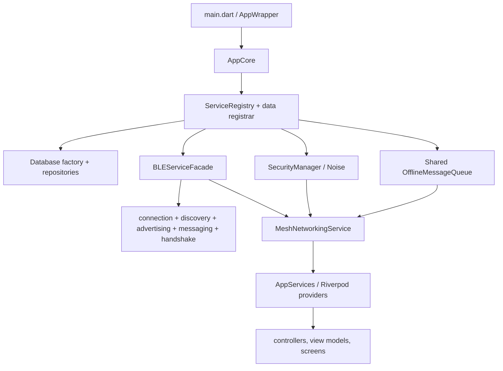
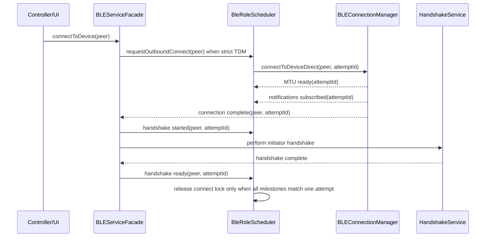

# PakConnect runtime flows

Last reconciled: 2026-07-11

This file records the main production paths and the identity used at each
boundary. It is intentionally implementation-oriented.

## Bootstrap and dependency graph

Database, queue and identity initialization are critical. BLE warm-up,
enhanced services, integrated services and monitoring may enter an explicit
degraded mode rather than making the whole application unusable.

## BLE link bring-up

Inbound links follow the same milestone rule. The lifecycle coordinator
allocates a scheduler attempt on the central-connected event and carries it
through MTU, subscribe, handshake-start and disconnect callbacks. A stale
event from another peer or an older attempt cannot complete the active lock.

The underlying BLE plugin exposes a peer address but no native connection
generation for inbound events. PakConnect assigns a generation at each
connected event; a native event mislabeled or delayed across two connections
to the same address cannot be distinguished below that API boundary. This is
tracked as a device-validation risk rather than hidden.

## Identity at transport boundaries

| Name | Meaning | Lifetime/use |
|---|---|---|
| BLE address/UUID | Platform route key | Selects a concrete client/server link and its MTU |
| Session/ephemeral ID | Rotating connection identity | `currentSessionId`, current peer matching |
| Relationship hint | Discovery/dedup alias | May appear as transport `fromNodeId` |
| Persistent public key | Paired identity | Stable contact/chat recipient after MEDIUM+ pairing |
| `Contact.publicKey` | Immutable DB primary key | Never replaced |

Transport routing may recognize several aliases, but completion of a
request/response round must not trust a peer-declared node ID. Queue sync uses
an opaque random `syncId` echoed by the response.

## Direct message send

1. UI/controller resolves the intended contact identity.
2. The offline queue persists the message before transport delivery.
3. `MeshQueueSyncCoordinator` checks the current peer aliases immediately
   before a direct send and requires exactly one active BLE address. If more
   than one route is live, direct queued delivery is deferred rather than
   trusting global peer state.
4. A queue-sync-triggered payload additionally requires its concrete requester
   address to be that sole active route.
5. The write adapter uses the sole route's handles/MTU and shares the same ACK
   tracker completed by inbound protocol dispatch.
6. Noise encrypts only after the session is established and advances the
   serialized send nonce.
7. Central and peripheral text sends return success only after the message ACK;
   the queue then marks the message delivered exactly once.

Multi-link control-frame routing is exact-address. Multi-link user-payload
delivery is intentionally fail-closed until connection records carry an
authoritative address/generation-to-handshake-identity binding and ACKs are
returned/correlated on that exact binding.

## Receive and GATT acknowledgement

1. Lifecycle handlers filter the expected message/service-changed
   characteristic.
2. Fragment metadata and payloads are validated and bounded during
   reassembly.
3. `IBLEMessageHandlerFacade.processReceivedData` either returns a legitimate
   result/null or throws `InboundMessageProcessingException` for structural
   failure.
4. The messaging service maps that typed failure to
   `InboundProcessStatus.failed`.
5. Peripheral GATT writes are ACKed only when accepted; structurally corrupt
   frames receive an error response.

Valid plaintext equal to an old internal sentinel string is ordinary content;
failure signaling is typed and cannot collide with user data.

## Mesh relay

1. Derive the deterministic message ID from timestamp, sender key and content.
2. Consult `SeenMessageStore` within the five-minute duplicate window.
3. Deliver locally before considering forwarding.
4. Forward only encrypted relay payloads and enforce the hop cap.
5. Persist/queue when a usable next hop is unavailable.

Direct recipient delivery and relay fan-out are separate paths so a next hop
does not receive direct plaintext by mistake.

## Queue synchronization

1. Initiator creates a queue request with a random 128-bit `syncId` and stores
   `syncId -> target transport key` while the round is pending.
2. Responder computes missing/excess IDs and always emits a response, including
   the already-synchronized case. Payload dispatch proceeds only through the
   single-link identity/route gate described above.
3. Response echoes the request `syncId`.
4. Coordinator rejects responses that do not bind both the random round token
   and the exact transport sender to a live pending round. Tokenless responses
   are rejected before they can mutate queue state.
5. Route loss or failed response send fails the pending round immediately;
   it does not masquerade as success or burn the full timeout.
6. Resume delivery prefilters by the connected peer's session, ephemeral and
   persistent aliases, then repeats the per-message recipient gate at send
   time.

## Verified friend reveal

1. The sender builds a signed `FRIEND_REVEAL` frame only after the user chooses
   to reveal. The facade writes it only when exactly one BLE route is active
   and reports success only when the protocol transport accepts the frame.
2. Fragmented or binary reveal frames are reassembled and handed to the legacy
   authenticated handler as complete bytes. The split protocol handler never
   emits an identity callback from the unverified payload.
3. The receiver rejects missing identities, timestamps more than five minutes
   in either direction, missing cached pairing state, invalid signatures, and
   claimed keys that do not equal `persistentPublicKey ?? publicKey` on the
   resolved contact.
4. A successful handler emits the verified persistent key, not a display name.
   Riverpod immediately snapshots it into `IdentityRevealInfo` with the bound
   contact primary key and `ChatId`.
5. The UI may navigate after the BLE link disappears because it uses that
   stable snapshot. Duplicate display names cannot redirect the action.

## Sender-local broadcast lists

The persisted `ContactGroup`/`GroupMessage` names are legacy schema/API names.
The product surface calls this feature **Broadcast Lists**.

1. The sender creates a local named list of contact chat identities.
2. A broadcast first persists one sender-local dispatch record with a pending
   status per recipient.
3. For each recipient, the service resolves the contact through
   `getContactByAnyId()` and queues the content as an ordinary direct message
   using the contact's canonical `chatId`.
4. The sender-local status becomes queued (persisted enum name `sent`) or
   failed. Direct-message ACKs are not currently correlated back to the
   broadcast record.
5. Each recipient sees only an ordinary one-to-one chat message and replies in
   that private chat. There is no group/list ID on the wire, synchronized
   membership, recipient-side shared transcript, group key, or admin model.

## Persistence

- Schema version: 12.
- WAL and foreign-key enforcement remain enabled.
- On Android/iOS, the application supplies SQLCipher a random 256-bit
  credential generated once and stored in platform secure storage. This is not
  an application passphrase/PBKDF2 flow.
- Export/import passphrases use PBKDF2-HMAC-SHA256 separately from database
  opening.
- Desktop tests can fall back to plaintext SQLite when a native SQLCipher
  library is unavailable. That fallback is test evidence, not proof of device
  encryption.
- `change_log` triggers support local change capture, export/import and
  bounded pruning. Production gossip does not instantiate or invoke the
  dormant peer-replay prototype, so it cannot query phantom outbound batches
  or advance peer cursors. The schema-v12 cursor remains for compatibility.
