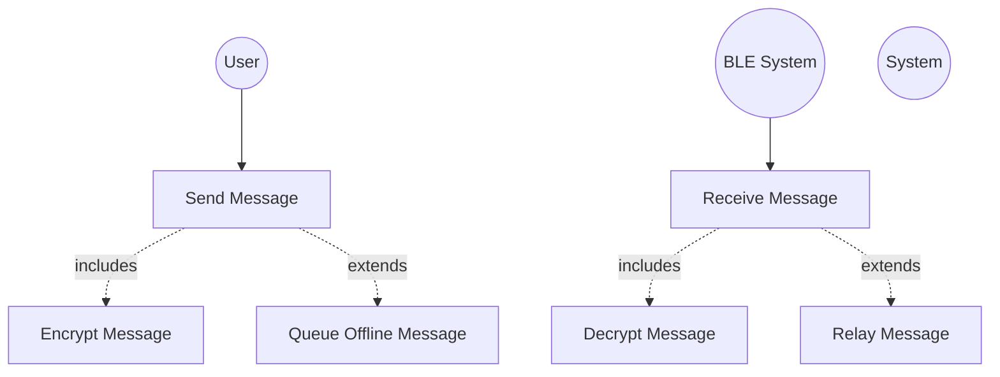

# Use Case Diagrams Context

This document provides structured context for generating use case diagrams.

## Primary Actors

1. **User** - Person using the PakConnect app
2. **BLE System** - Bluetooth Low Energy hardware/OS layer
3. **System** - Automated internal processes (timers, schedulers)

## Use Case Diagram 1: Core Messaging

### Actors
- User (primary)
- BLE System (supporting)

### Use Cases

**UC-1: Send Message**
- Actor: User
- Precondition: Contact exists, BLE available
- Main Flow: User types message → Encrypt → Send via BLE
- Includes: UC-2 (Encrypt Message)
- Extends: UC-3 (Queue Message if offline)

**UC-2: Encrypt Message**
- Actor: System
- Precondition: Noise session established
- Main Flow: Encrypt with ChaCha20-Poly1305 → Add nonce

**UC-3: Queue Offline Message**
- Actor: System
- Precondition: Recipient offline
- Main Flow: Store in queue → Retry on reconnection

**UC-4: Receive Message**
- Actor: BLE System
- Main Flow: Receive BLE notification → Decrypt → Display
- Includes: UC-5 (Decrypt Message)

**UC-5: Decrypt Message**
- Actor: System
- Precondition: Noise session established
- Main Flow: Verify MAC → Decrypt → Deliver

**UC-6: Relay Message**
- Actor: System
- Precondition: Relay enabled, not duplicate
- Main Flow: Check relay rules → Forward to next hop
- Includes: UC-1 (Send Message to next hop)

### Relationships
```
User -----> (Send Message)
(Send Message) ..includes..> (Encrypt Message)
(Send Message) ..extends..> (Queue Offline Message)
BLE System -----> (Receive Message)
(Receive Message) ..includes..> (Decrypt Message)
(Receive Message) ..extends..> (Relay Message)
```

## Use Case Diagram 2: Contact Management

### Actors
- User (primary)

### Use Cases

**UC-7: Add Contact via QR**
- Actor: User
- Main Flow: Scan QR → Parse public key → Initiate handshake
- Includes: UC-8 (Perform Handshake)

**UC-8: Perform Noise Handshake**
- Actor: System
- Main Flow: XX/KK pattern exchange → Establish session → Save contact

**UC-9: Verify Contact**
- Actor: User
- Main Flow: Enter PIN or compare fingerprint → Upgrade security level

**UC-10: Delete Contact**
- Actor: User
- Main Flow: Select contact → Confirm → Delete from DB → Remove sessions

**UC-11: Mark Favorite**
- Actor: User
- Main Flow: Star contact → Update is_favorite flag

**UC-12: Search Contacts**
- Actor: User
- Main Flow: Enter query → Search by name/key → Display results

### Relationships
```
User -----> (Add Contact via QR)
(Add Contact via QR) ..includes..> (Perform Noise Handshake)
User -----> (Verify Contact)
User -----> (Delete Contact)
User -----> (Mark Favorite)
User -----> (Search Contacts)
```

## Use Case Diagram 3: Chat Management

### Actors
- User (primary)
- System (secondary)

### Use Cases

**UC-13: Open Chat**
- Actor: User
- Main Flow: Select contact → Load messages → Display

**UC-14: Archive Chat**
- Actor: User
- Main Flow: Select chat → Move to archive table → Hide from list
- Alternative: Auto-archive by policy (actor: System)

**UC-15: Pin Chat**
- Actor: User
- Main Flow: Pin chat → Set is_pinned=1 → Sort to top

**UC-16: Delete Chat**
- Actor: User
- Main Flow: Select chat → Confirm → Delete messages + chat row

**UC-17: Export Chat**
- Actor: User
- Main Flow: Select format (JSON/text) → Generate file → Share

**UC-18: Search Messages**
- Actor: User
- Main Flow: Enter query → FTS5 search → Display results

**UC-19: Star Message**
- Actor: User
- Main Flow: Long-press message → Toggle star → Update flag

### Relationships
```
User -----> (Open Chat)
User -----> (Archive Chat)
System -----> (Archive Chat) : auto-archive
User -----> (Pin Chat)
User -----> (Delete Chat)
User -----> (Export Chat)
User -----> (Search Messages)
User -----> (Star Message)
```

## Use Case Diagram 4: Group Messaging

### Actors
- User (primary)

### Use Cases

**UC-20: Create Group**
- Actor: User
- Main Flow: Enter name → Select members → Save to group table

**UC-21: Add Member to Group**
- Actor: User
- Main Flow: Select contact → Add to group_members table

**UC-22: Remove Member from Group**
- Actor: User
- Main Flow: Select member → Remove from junction table

**UC-23: Send Group Message**
- Actor: User
- Main Flow: Type message → Send to each member individually
- Includes: UC-1 (Send Message) for each member

**UC-24: View Group Delivery Status**
- Actor: User
- Main Flow: Select message → Display per-member status

### Relationships
```
User -----> (Create Group)
User -----> (Add Member to Group)
User -----> (Remove Member from Group)
User -----> (Send Group Message)
(Send Group Message) ..includes..> (Send Message) : N times
User -----> (View Group Delivery Status)
```

## Use Case Diagram 5: Security & Keys

### Actors
- User (primary)
- System (automated)

### Use Cases

**UC-25: Generate Identity Keys**
- Actor: System
- Trigger: First launch
- Main Flow: Generate X25519 keypair → Save to secure storage

**UC-26: Initiate Handshake (XX Pattern)**
- Actor: System
- Precondition: New contact
- Main Flow: 3-message handshake → Establish session

**UC-27: Initiate Handshake (KK Pattern)**
- Actor: System
- Precondition: Known contact (persistent key exists)
- Main Flow: 2-message handshake → Establish session

**UC-28: Rekey Session**
- Actor: System
- Trigger: 10k messages or 1 hour
- Main Flow: Generate new ephemeral key → Perform handshake

**UC-29: Upgrade Security Level**
- Actor: User
- Main Flow: Enter PIN → Verify → Set persistent key → Update level

**UC-30: Rotate Ephemeral Keys**
- Actor: System
- Trigger: Timer (periodic)
- Main Flow: Generate new ephemeral ID → Cleanup expired keys

### Relationships
```
System -----> (Generate Identity Keys) : first launch
System -----> (Initiate Handshake XX)
System -----> (Initiate Handshake KK)
System -----> (Rekey Session) : periodic
User -----> (Upgrade Security Level)
System -----> (Rotate Ephemeral Keys) : scheduled
```

## Use Case Diagram 6: Mesh Networking

### Actors
- System (automated relay logic)

### Use Cases

**UC-31: Process Incoming Relay Message**
- Actor: System
- Main Flow: Receive → Check duplicate → Decide relay/deliver

**UC-32: Relay to Next Hop**
- Actor: System
- Precondition: Not duplicate, hop count < 5
- Main Flow: Smart routing → Send to optimal next hop

**UC-33: Deliver to Self**
- Actor: System
- Precondition: Final recipient is current node
- Main Flow: Extract content → Save to repository → Notify user

**UC-34: Block Duplicate**
- Actor: System
- Precondition: Message ID seen in last 5 minutes
- Main Flow: Check SeenMessageStore → Drop message

**UC-35: Prevent Spam**
- Actor: System
- Main Flow: Check rate limits → Block if exceeds threshold

**UC-36: Sync Message Queues**
- Actor: System
- Trigger: Device reconnection
- Main Flow: Compare queue hashes → Exchange missing messages

### Relationships
```
System -----> (Process Incoming Relay Message)
(Process Incoming Relay Message) ..extends..> (Relay to Next Hop)
(Process Incoming Relay Message) ..extends..> (Deliver to Self)
(Process Incoming Relay Message) ..extends..> (Block Duplicate)
System -----> (Prevent Spam)
System -----> (Sync Message Queues) : on reconnection
```

## Mermaid Syntax Example (Use Case Diagram 1)



---

**Total Use Cases**: 36
**Diagram Count**: 6 major groupings
**Last Updated**: 2025-01-19
