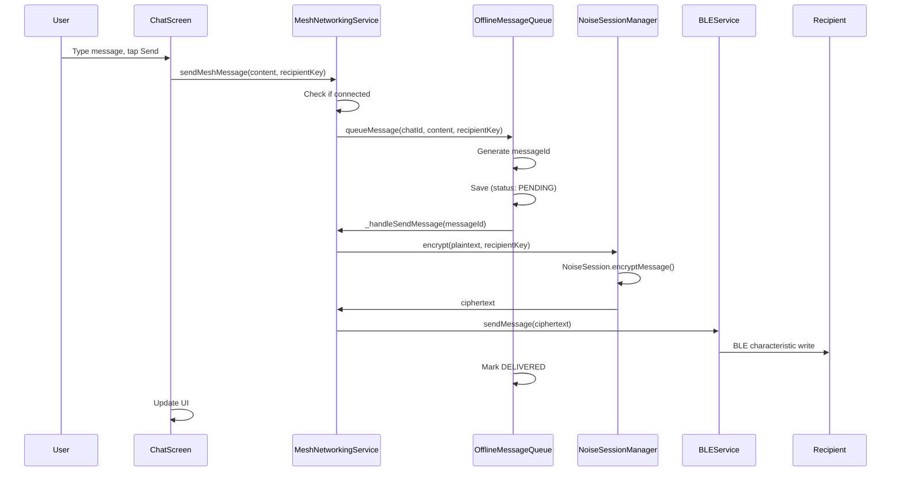
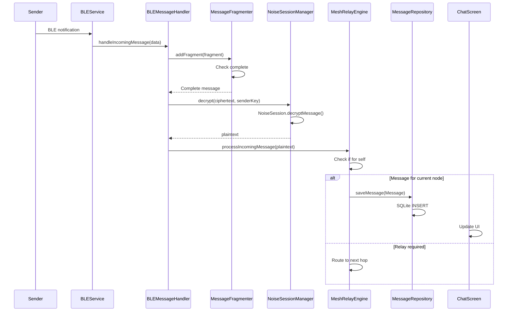
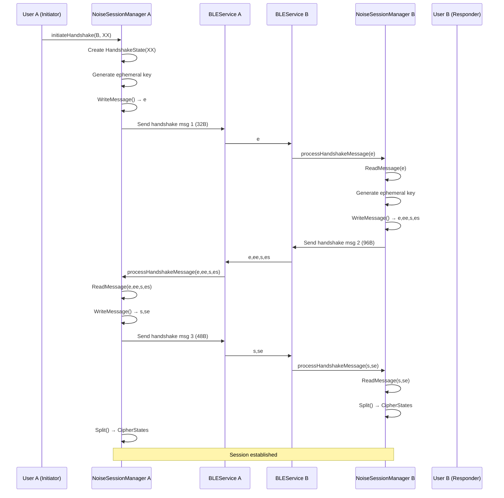
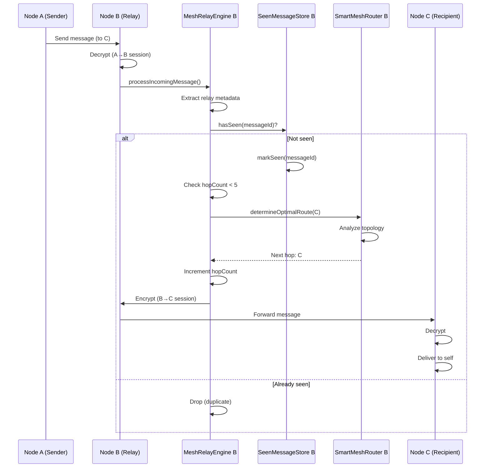
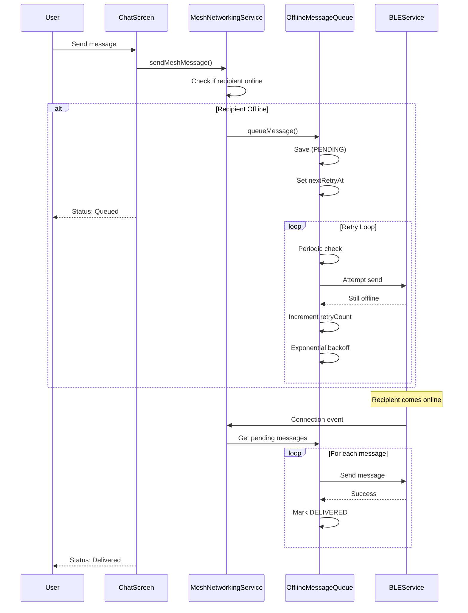
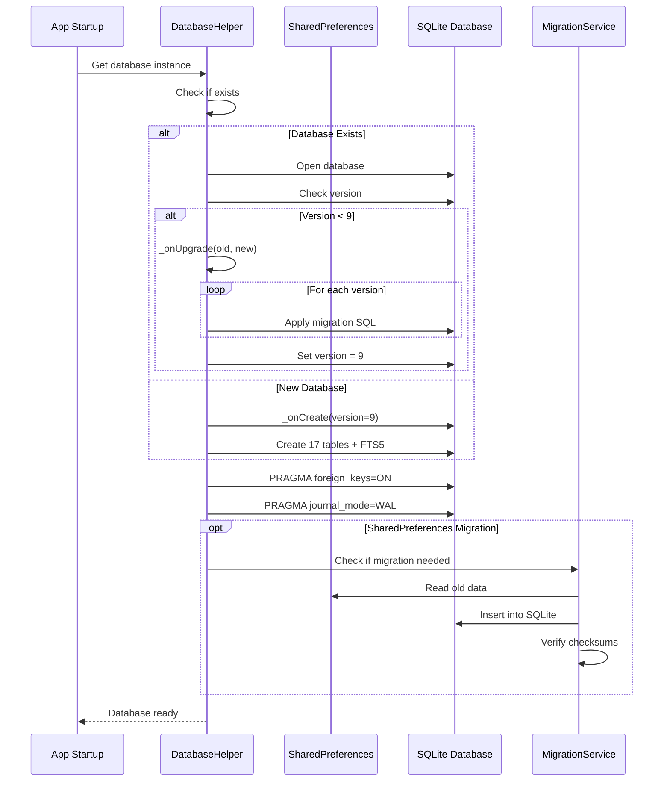

# Sequence Diagrams Context

This document provides structured context for generating sequence diagrams of key flows.

## Sequence Diagram 1: Send Message (Direct Delivery)

### Participants
- User
- ChatScreen (UI)
- MeshNetworkingService
- OfflineMessageQueue
- NoiseSessionManager
- BLEService
- Recipient

### Flow
```
1. User types message, taps Send
2. ChatScreen → MeshNetworkingService.sendMeshMessage(content, recipientKey)
3. MeshNetworkingService → Check if recipient directly connected
4. IF connected:
   5. MeshNetworkingService → OfflineMessageQueue.queueMessage(chatId, content, recipientKey)
   6. OfflineMessageQueue → Generate messageId (timestamp-based)
   7. OfflineMessageQueue → Save to queue (status: PENDING)
   8. OfflineMessageQueue → Trigger delivery
   9. OfflineMessageQueue → MeshNetworkingService._handleSendMessage(messageId)
   10. MeshNetworkingService → NoiseSessionManager.encrypt(plaintext, recipientKey)
   11. NoiseSessionManager → NoiseSession.encryptMessage(plaintext)
   12. NoiseSession → CipherState.encryptWithAd(plaintext, nonce)
   13. NoiseSession → Return ciphertext
   14. MeshNetworkingService → MessageFragmenter.fragment(ciphertext)
   15. MessageFragmenter → Split into chunks (if > MTU)
   16. MeshNetworkingService → BLEService.sendMessage(ciphertext)
   17. BLEService → Write to BLE characteristic
   18. BLEService → Recipient device
   19. OfflineMessageQueue → Mark messageId as DELIVERED
   20. OfflineMessageQueue → Save to MessageRepository
   21. ChatScreen ← Update UI (message sent)
```

### Mermaid Syntax


## Sequence Diagram 2: Receive Message

### Participants
- Sender
- BLEService
- BLEMessageHandler
- MessageFragmenter
- NoiseSessionManager
- MeshRelayEngine
- MessageRepository
- ChatScreen

### Flow
```
1. Sender → BLEService (characteristic notification received)
2. BLEService → BLEMessageHandler.handleIncomingMessage(data)
3. BLEMessageHandler → Check if fragmented
4. IF fragmented:
   5. BLEMessageHandler → MessageFragmenter.addFragment(fragment)
   6. MessageFragmenter → Check if complete
   7. IF incomplete: Return (wait for more)
   8. IF complete: MessageFragmenter → Reassemble fragments
9. BLEMessageHandler → NoiseSessionManager.decrypt(ciphertext, senderKey)
10. NoiseSessionManager → NoiseSession.decryptMessage(ciphertext)
11. NoiseSession → CipherState.decryptWithAd(ciphertext, nonce)
12. NoiseSession → Verify MAC tag
13. NoiseSession → Return plaintext
14. BLEMessageHandler → MeshRelayEngine.processIncomingMessage(plaintext, senderKey)
15. MeshRelayEngine → Check if for current node
16. IF for self:
   17. MeshRelayEngine → MessageRepository.saveMessage(Message)
   18. MessageRepository → SQLite INSERT
   19. ChatScreen ← Notification (new message)
   20. ChatScreen ← Update UI
17. ELSE (relay):
   18. MeshRelayEngine → Check duplicate
   19. MeshRelayEngine → SmartMeshRouter.determineOptimalRoute()
   20. MeshRelayEngine → Queue for relay to next hop
```

### Mermaid Syntax


## Sequence Diagram 3: Noise Handshake (XX Pattern)

### Participants
- Initiator (User A)
- Responder (User B)
- NoiseSessionManager (A)
- NoiseSessionManager (B)
- BLEService (A)
- BLEService (B)

### Flow
```
1. Initiator → NoiseSessionManager(A).initiateHandshake(peerID, pattern=XX)
2. NoiseSessionManager(A) → Create HandshakeState(XX, initiator=true)
3. HandshakeState(A) → Generate ephemeral keypair
4. HandshakeState(A) → WriteMessage() → e (32 bytes)
5. BLEService(A) → Send "e" to Responder
6. BLEService(B) → Receive "e"
7. NoiseSessionManager(B) → processHandshakeMessage(peerID, data)
8. HandshakeState(B) → ReadMessage(e)
9. HandshakeState(B) → Generate ephemeral keypair
10. HandshakeState(B) → WriteMessage() → e, ee, s, es (96 bytes)
11. BLEService(B) → Send "e, ee, s, es" to Initiator
12. BLEService(A) → Receive "e, ee, s, es"
13. HandshakeState(A) → ReadMessage(e, ee, s, es)
14. HandshakeState(A) → Extract remote static key
15. HandshakeState(A) → WriteMessage() → s, se (48 bytes)
16. BLEService(A) → Send "s, se" to Responder
17. BLEService(B) → Receive "s, se"
18. HandshakeState(B) → ReadMessage(s, se)
19. HandshakeState(B) → Extract remote static key
20. Both → Split() → Generate send/receive CipherStates
21. Both → Session established, ready for encryption
```

### Mermaid Syntax


## Sequence Diagram 4: Mesh Relay (A→B→C)

### Participants
- Node A (Originator)
- Node B (Relay)
- Node C (Final Recipient)
- MeshRelayEngine (B)
- SmartMeshRouter (B)
- SeenMessageStore (B)

### Flow
```
1. Node A → Create message for Node C
2. Node A → Send to Node B (nearest hop)
3. Node B (BLEService) → Receive message
4. Node B → Decrypt with Noise session (A→B)
5. Node B → MeshRelayEngine.processIncomingMessage(message)
6. MeshRelayEngine → Extract relay metadata
7. MeshRelayEngine → Check finalRecipient != current node
8. MeshRelayEngine → SeenMessageStore.hasSeen(messageId)
9. IF seen: Drop (duplicate)
10. IF not seen:
   11. SeenMessageStore → markSeen(messageId, timestamp)
   12. MeshRelayEngine → Check hopCount < maxHops (5)
   13. MeshRelayEngine → SmartMeshRouter.determineOptimalRoute(C, availableHops)
   14. SmartMeshRouter → NetworkTopologyAnalyzer.estimateNetworkSize()
   15. SmartMeshRouter → ConnectionQualityMonitor.getQuality(C)
   16. SmartMeshRouter → RouteCalculator.calculateRoute()
   17. SmartMeshRouter → Return optimal next hop (Node C or intermediary)
   18. MeshRelayEngine → Increment hopCount
   19. MeshRelayEngine → Encrypt with Noise session (B→C or B→intermediary)
   20. MeshRelayEngine → BLEService.sendMessage(nextHop, ciphertext)
21. Node C → Receive message
22. Node C → Decrypt
23. Node C → MeshRelayEngine.processIncomingMessage()
24. MeshRelayEngine → Check finalRecipient == current node
25. MeshRelayEngine → Deliver to self (save to MessageRepository)
```

### Mermaid Syntax


## Sequence Diagram 5: Offline Message Queue

### Participants
- User
- ChatScreen
- MeshNetworkingService
- OfflineMessageQueue
- BLEService (offline)
- BLEService (comes online)
- Recipient

### Flow
```
1. User → Send message to offline recipient
2. ChatScreen → MeshNetworkingService.sendMeshMessage()
3. MeshNetworkingService → Check if recipient connected
4. IF offline:
   5. MeshNetworkingService → OfflineMessageQueue.queueMessage()
   6. OfflineMessageQueue → Save to offline_message_queue table (status: PENDING)
   7. OfflineMessageQueue → Set nextRetryAt = now + backoff
   8. ChatScreen ← Status: "Queued for delivery"
9. [TIME PASSES - Retry attempts]
10. OfflineMessageQueue → Periodic check (every 30s)
11. OfflineMessageQueue → Check nextRetryAt <= now
12. OfflineMessageQueue → Attempt send via BLEService
13. IF still offline:
   14. OfflineMessageQueue → Increment retryCount
   15. OfflineMessageQueue → Calculate exponential backoff
   16. OfflineMessageQueue → Set nextRetryAt = now + backoff
   17. IF retryCount > maxRetries:
      18. OfflineMessageQueue → Mark status: FAILED
19. [RECIPIENT COMES ONLINE]
20. BLEService → Connection established event
21. BLEService → MeshNetworkingService._handleConnectionChange(deviceId)
22. MeshNetworkingService → _deliverQueuedMessagesToDevice(deviceId)
23. MeshNetworkingService → Get messages for deviceId (status: PENDING/RETRYING)
24. FOR EACH message:
   25. MeshNetworkingService → _handleSendMessage(messageId)
   26. Encrypt → Send via BLE → Mark DELIVERED
27. ChatScreen ← Status: "Delivered"
```

### Mermaid Syntax


## Sequence Diagram 6: Database Migration

### Participants
- App Startup
- DatabaseHelper
- SharedPreferences
- SQLite Database
- MigrationService

### Flow
```
1. App Startup → DatabaseHelper.database (first access)
2. DatabaseHelper → Check if database exists
3. IF exists:
   4. DatabaseHelper → Open database
   5. DatabaseHelper → Check current version
   6. IF version < latest (9):
      7. DatabaseHelper → _onUpgrade(db, oldVersion, newVersion)
      8. FOR EACH version upgrade (e.g., v7 → v8 → v9):
         9. Apply migration SQL (ALTER TABLE, CREATE INDEX, etc.)
         10. Log migration completion
   11. DatabaseHelper → Set new version
12. IF not exists:
   13. DatabaseHelper → _onCreate(db, version=9)
   14. Create all 17 tables + indexes + FTS5
15. DatabaseHelper → Enable foreign keys (PRAGMA)
16. DatabaseHelper → Enable WAL mode (PRAGMA)
17. [OPTIONAL: SharedPreferences → SQLite migration]
18. IF migration needed:
   19. MigrationService → Check migration_metadata table
   20. IF not migrated:
      21. MigrationService → Read SharedPreferences data
      22. MigrationService → Convert to SQLite format
      23. MigrationService → Insert into tables
      24. MigrationService → Verify checksums
      25. MigrationService → Mark migration complete
26. DatabaseHelper → Return database instance
```

### Mermaid Syntax


---

**Total Sequence Diagrams**: 6 key flows
**Last Updated**: 2025-01-19
