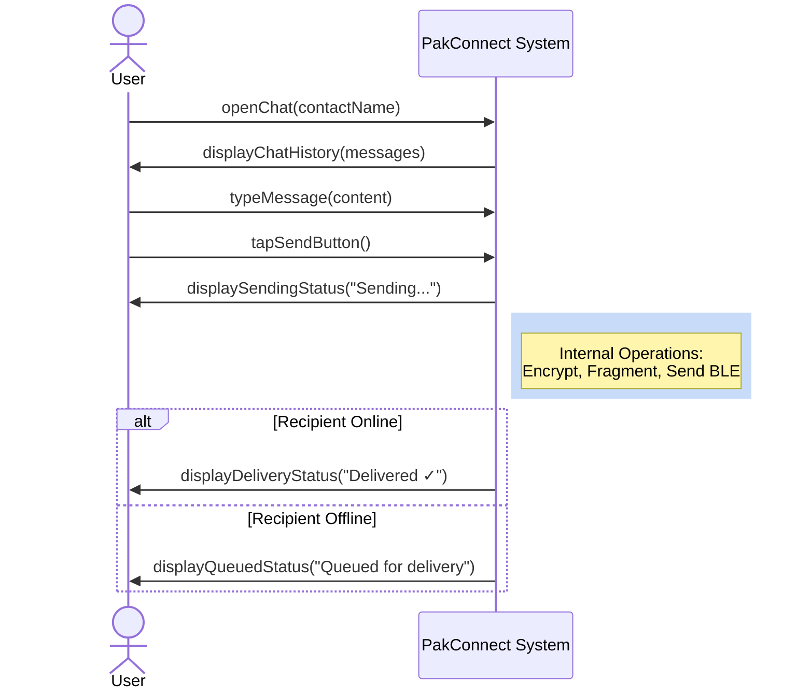
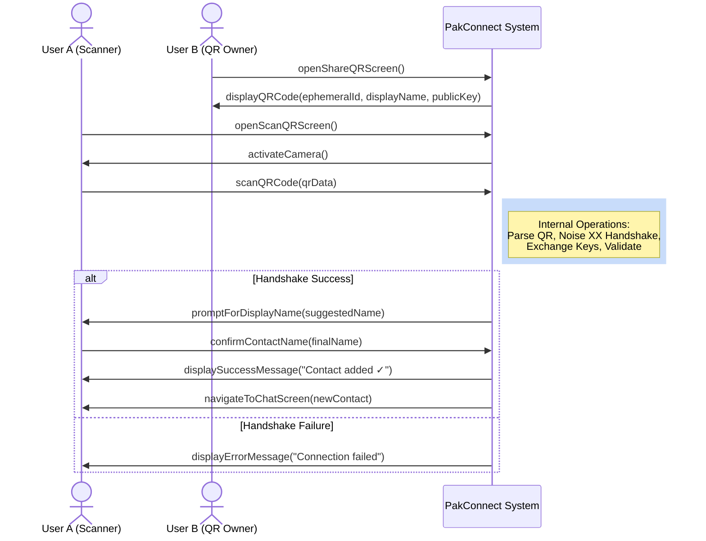
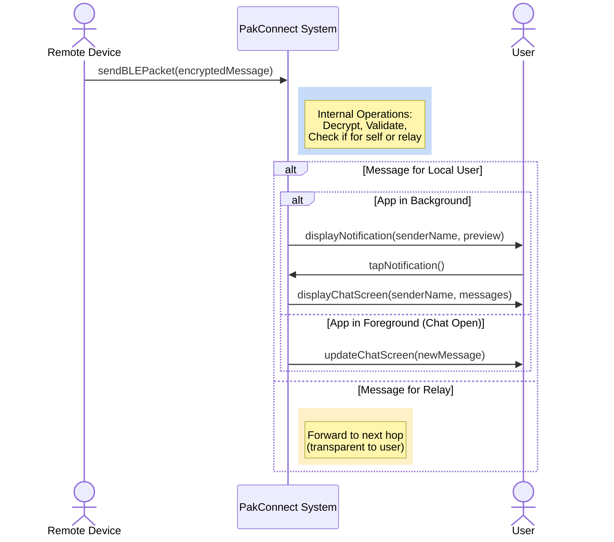
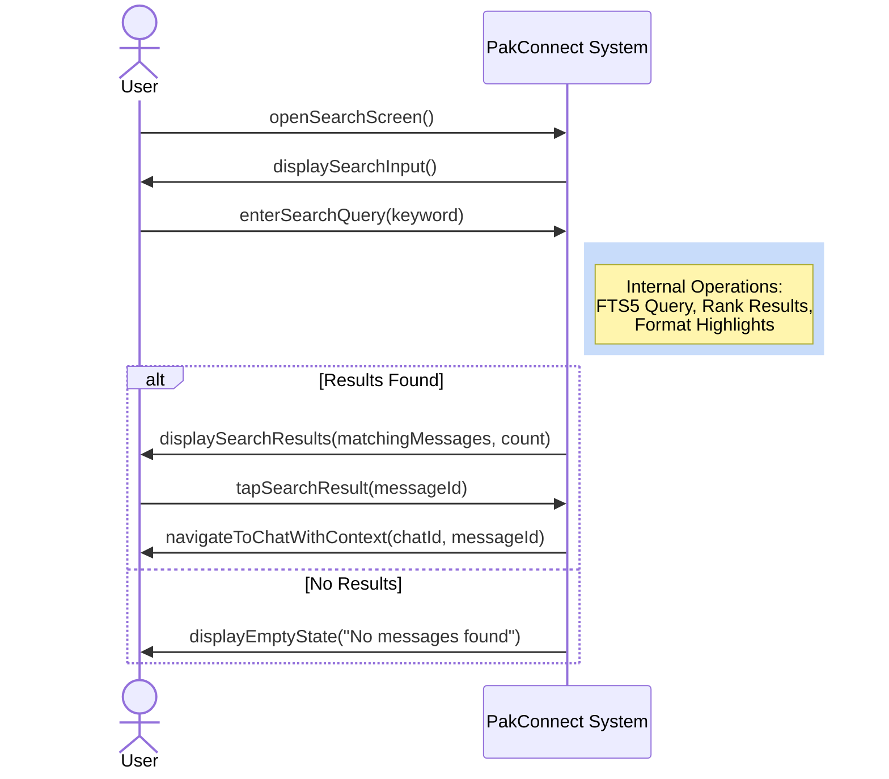
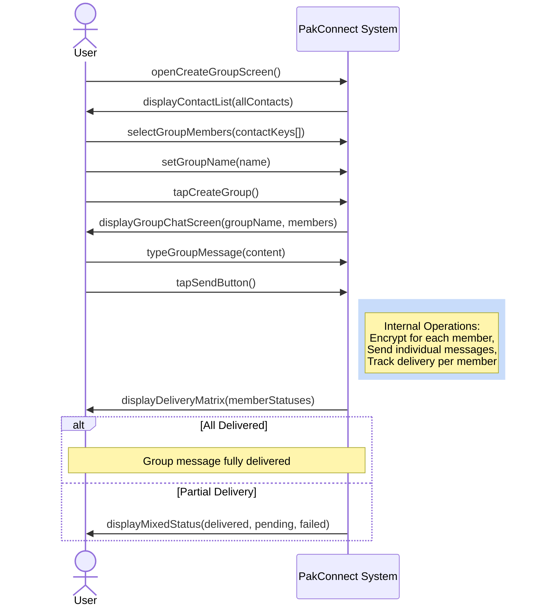
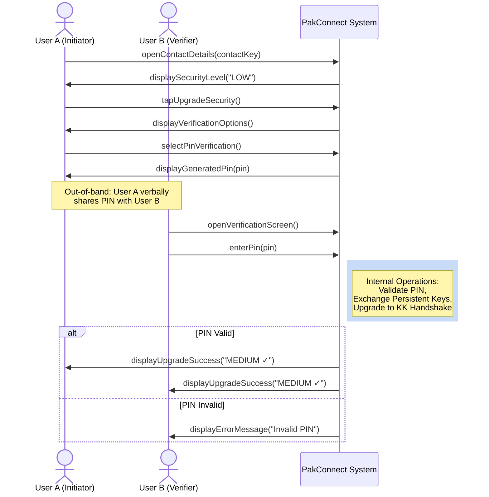
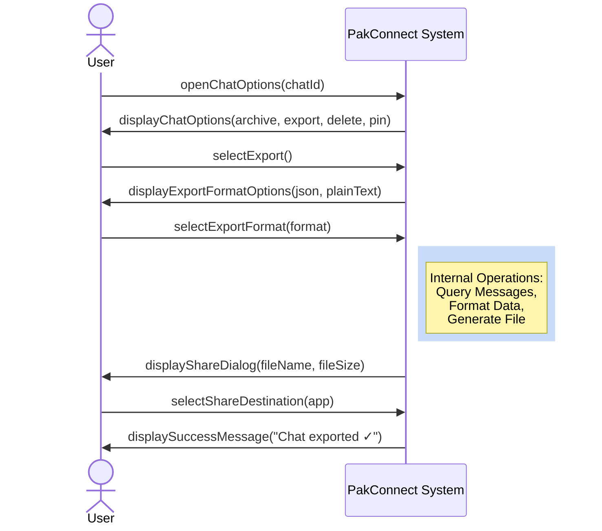

# System Sequence Diagrams

## Overview

System Sequence Diagrams (SSDs) show **high-level interactions between actors and the system** as a black box. Unlike detailed sequence diagrams (which show internal component interactions), SSDs focus on the **system boundary** and **user-facing operations**.

**Key Differences**:
- **System Sequence Diagrams (this file)**: Actor ↔ System (black box)
- **Sequence Diagrams (`06-sequence-diagrams.md`)**: Internal components (white box)

---

## SSD-1: Send Message to Contact

### Participants
- **User**: Person using the app
- **PakConnect System**: The application (black box)

### Scenario
User sends an encrypted message to a contact via BLE.

### Sequence

1. **User → System**: openChat(contactName)
   - User navigates to chat with a contact

2. **System → User**: displayChatHistory(messages)
   - System shows previous conversation

3. **User → System**: typeMessage(content)
   - User types message text

4. **User → System**: tapSendButton()
   - User confirms send

5. **System → User**: displaySendingStatus("Sending...")
   - System shows message as "Sending"

6. **System → System**: [Internal: encrypt, fragment, send via BLE]
   - System performs cryptographic and BLE operations

7. **System → User**: displayDeliveryStatus("Delivered ✓")
   - System confirms successful delivery

**Alternative Flow 7a: Recipient Offline**
- 7a1. **System → User**: displayQueuedStatus("Queued for delivery")
- 7a2. System queues message for retry

### Diagram Context (Mermaid)

---

## SSD-2: Add Contact via QR Code

### Participants
- **User A**: Person adding a new contact
- **User B**: Person being added (initiates QR sharing)
- **PakConnect System**: The application (black box)

### Scenario
User A scans User B's QR code to establish an encrypted session and add them as a contact.

### Sequence

1. **User B → System**: openShareQRScreen()
   - User B navigates to "Share My QR" screen

2. **System → User B**: displayQRCode(ephemeralId, displayName, publicKey)
   - System generates and shows QR code

3. **User A → System**: openScanQRScreen()
   - User A navigates to "Scan QR" screen

4. **System → User A**: activateCamera()
   - System requests camera permission and shows viewfinder

5. **User A → System**: scanQRCode(qrData)
   - User A points camera at User B's QR code

6. **System → System**: [Internal: parse QR, initiate Noise handshake, exchange keys]
   - System performs XX handshake protocol

7. **System → User A**: promptForDisplayName(suggestedName)
   - System asks User A to confirm contact name

8. **User A → System**: confirmContactName(finalName)
   - User A confirms or edits name

9. **System → User A**: displaySuccessMessage("Contact added ✓")
   - System confirms contact saved

10. **System → User A**: navigateToChatScreen(newContact)
    - System opens chat with newly added contact

**Alternative Flow 6a: Handshake Failure**
- 6a1. **System → User A**: displayErrorMessage("Connection failed. Try again.")
- 6a2. User A returns to scan screen

### Diagram Context (Mermaid)

---

## SSD-3: Receive Incoming Message

### Participants
- **Remote Device**: Sender's device (external actor)
- **User**: Recipient (local user)
- **PakConnect System**: The application (black box)

### Scenario
User receives an encrypted message from a remote device via BLE.

### Sequence

1. **Remote Device → System**: sendBLEPacket(encryptedMessage)
   - Remote device sends encrypted message via BLE characteristic

2. **System → System**: [Internal: decrypt, validate, process relay decision]
   - System decrypts and determines if message is for local user or relay

3. **System → User**: displayNotification(senderName, previewText)
   - System shows notification banner

4. **User → System**: tapNotification()
   - User taps notification to open chat

5. **System → User**: displayChatScreen(senderName, messages)
   - System opens chat with new message highlighted

6. **System → System**: [Internal: mark as read, update chat list]
   - System updates message status and chat preview

**Alternative Flow 2a: Message is for Relay**
- 2a1. **System → System**: [Internal: forward to next hop]
- 2a2. No user notification (relay is transparent)

**Alternative Flow 3a: App in Foreground**
- 3a1. **System → User**: updateChatScreen(newMessage)
- 3a2. No notification shown (message appears directly in open chat)

### Diagram Context (Mermaid)

---

## SSD-4: Search Messages

### Participants
- **User**: Person searching for messages
- **PakConnect System**: The application (black box)

### Scenario
User searches for messages across all chats or within a specific chat.

### Sequence

1. **User → System**: openSearchScreen()
   - User navigates to search interface

2. **System → User**: displaySearchInput()
   - System shows search input field

3. **User → System**: enterSearchQuery(keyword)
   - User types search term

4. **System → System**: [Internal: query database with FTS5, rank results]
   - System performs full-text search

5. **System → User**: displaySearchResults(matchingMessages, count)
   - System shows matching messages with highlighted keywords

6. **User → System**: tapSearchResult(messageId)
   - User selects a result

7. **System → User**: navigateToChatWithContext(chatId, messageId)
   - System opens chat and scrolls to selected message

**Alternative Flow 5a: No Results Found**
- 5a1. **System → User**: displayEmptyState("No messages found")

### Diagram Context (Mermaid)

---

## SSD-5: Create and Send Group Message

### Participants
- **User**: Person sending group message
- **PakConnect System**: The application (black box)

### Scenario
User creates a group, adds members, and sends a message to all members.

### Sequence

1. **User → System**: openCreateGroupScreen()
   - User navigates to group creation

2. **System → User**: displayContactList(allContacts)
   - System shows all contacts for selection

3. **User → System**: selectGroupMembers(contactKeys[])
   - User selects multiple contacts

4. **User → System**: setGroupName(name)
   - User enters group name

5. **User → System**: tapCreateGroup()
   - User confirms group creation

6. **System → User**: displayGroupChatScreen(groupName, members)
   - System shows group chat interface

7. **User → System**: typeGroupMessage(content)
   - User types message

8. **User → System**: tapSendButton()
   - User sends group message

9. **System → System**: [Internal: encrypt for each member, send individual messages]
   - System sends individual encrypted messages (multi-unicast)

10. **System → User**: displayDeliveryMatrix(memberStatuses)
    - System shows per-member delivery status

**Alternative Flow 10a: Partial Delivery**
- 10a1. **System → User**: displayMixedStatus(deliveredCount, pendingCount, failedCount)
- 10a2. System continues retrying pending messages

### Diagram Context (Mermaid)

---

## SSD-6: Verify Contact Security

### Participants
- **User A**: Person initiating verification
- **User B**: Person being verified (must be present)
- **PakConnect System**: The application (black box)

### Scenario
User A upgrades contact security from LOW to MEDIUM by verifying a 4-digit PIN with User B in person.

### Sequence

1. **User A → System**: openContactDetails(contactKey)
   - User A opens contact information screen

2. **System → User A**: displaySecurityLevel("LOW - Ephemeral Session")
   - System shows current security level

3. **User A → System**: tapUpgradeSecurity()
   - User A initiates security upgrade

4. **System → User A**: displayVerificationOptions(pinVerification, fingerprintVerification)
   - System shows available verification methods

5. **User A → System**: selectPinVerification()
   - User A chooses PIN-based verification

6. **System → User A**: displayGeneratedPin(pin)
   - System generates and shows 4-digit PIN

7. **User A → User B**: [Out-of-band: verbally share PIN]
   - User A tells PIN to User B in person

8. **User B → System**: openVerificationScreen()
   - User B navigates to verification on their device

9. **User B → System**: enterPin(pin)
   - User B enters PIN shown by User A

10. **System → System**: [Internal: validate PIN, exchange persistent keys, upgrade session]
    - System performs KK handshake with persistent keys

11. **System → User A**: displayUpgradeSuccess("Security level: MEDIUM ✓")
    - System confirms upgrade on User A's device

12. **System → User B**: displayUpgradeSuccess("Security level: MEDIUM ✓")
    - System confirms upgrade on User B's device

**Alternative Flow 9a: PIN Mismatch**
- 9a1. **System → User B**: displayErrorMessage("Invalid PIN")
- 9a2. User B can retry (max 3 attempts)

### Diagram Context (Mermaid)

---

## SSD-7: Export Chat History

### Participants
- **User**: Person exporting chat
- **PakConnect System**: The application (black box)

### Scenario
User exports a chat conversation to a file for backup or sharing.

### Sequence

1. **User → System**: openChatOptions(chatId)
   - User opens chat settings menu

2. **System → User**: displayChatOptions(archive, export, delete, pin)
   - System shows available actions

3. **User → System**: selectExport()
   - User chooses export option

4. **System → User**: displayExportFormatOptions(json, plainText)
   - System asks for export format

5. **User → System**: selectExportFormat(format)
   - User selects JSON or plain text

6. **System → System**: [Internal: query messages, format data, encrypt if requested]
   - System retrieves and formats chat history

7. **System → User**: displayShareDialog(fileName, fileSize)
   - System shows native share sheet

8. **User → System**: selectShareDestination(app)
   - User chooses where to save/share (e.g., Files, Email, Drive)

9. **System → User**: displaySuccessMessage("Chat exported ✓")
   - System confirms export completion

**Alternative Flow 5a: Encrypted Export**
- 5a1. **System → User**: promptForExportPassword()
- 5a2. **User → System**: enterExportPassword(password)
- 5a3. System encrypts file with password before export

### Diagram Context (Mermaid)

---

## Summary

**Total System Sequence Diagrams**: 7

**Coverage**:
1. **SSD-1**: Send Message to Contact (core messaging)
2. **SSD-2**: Add Contact via QR Code (onboarding)
3. **SSD-3**: Receive Incoming Message (passive reception)
4. **SSD-4**: Search Messages (discovery)
5. **SSD-5**: Create and Send Group Message (group messaging)
6. **SSD-6**: Verify Contact Security (security upgrade)
7. **SSD-7**: Export Chat History (data portability)

**Key Characteristics**:
- **Black-box perspective**: System internals shown as abstract notes
- **User-facing operations**: Focus on observable interactions
- **Alternative flows**: Error handling and edge cases documented
- **Out-of-band actions**: Real-world interactions (e.g., verbal PIN sharing) noted

**Complementary Diagrams**:
- See `06-sequence-diagrams.md` for detailed internal component interactions
- See `09-activity-statemachine-diagrams.md` for process flows and state transitions

**Last Updated**: 2025-01-19
