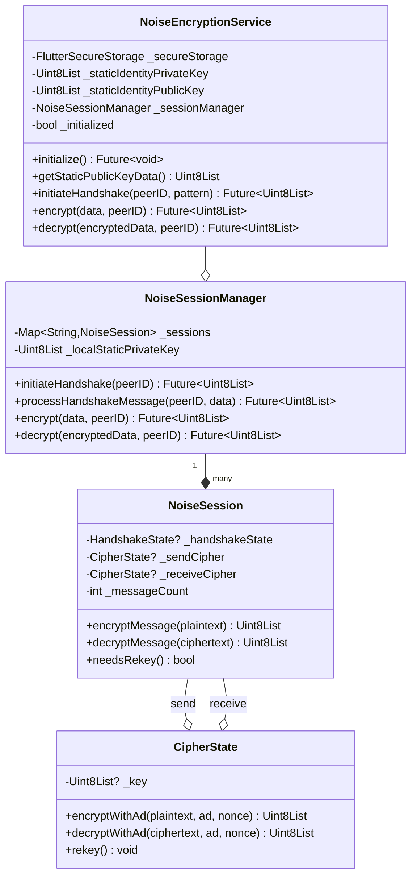

# Class Diagrams & Domain Model Context

This document provides structured context for generating class diagrams and domain models.

## Domain Model (Conceptual Entities)

### Core Entities

**1. User**
- Attributes: staticPublicKey, staticPrivateKey, displayName
- Relationships: Has many Contacts, Has many Chats

**2. Contact**
- Attributes: publicKey (immutable), persistentPublicKey (nullable), currentEphemeralId (nullable), displayName, securityLevel, trustStatus, isFavorite
- Relationships: Belongs to User, Has one Chat, Member of many Groups

**3. Chat**
- Attributes: chatId, contactPublicKey, lastMessage, lastMessageTime, unreadCount, isArchived, isPinned
- Relationships: Belongs to Contact, Has many Messages

**4. Message**
- Attributes: id, chatId, content, timestamp, isFromMe, status, replyToMessageId
- Relationships: Belongs to Chat, May reply to another Message

**5. ContactGroup**
- Attributes: id, name, description, createdAt
- Relationships: Has many Contacts (many-to-many)

**6. GroupMessage**
- Attributes: id, groupId, senderKey, content, timestamp, deliveryStatus (map)
- Relationships: Belongs to Group, Has many DeliveryRecords

**7. NoiseSession**
- Attributes: peerID, pattern (XX/KK), state (handshaking/established), sendCipherState, receiveCipherState
- Relationships: Belongs to Contact

**8. QueuedMessage**
- Attributes: id, chatId, content, recipientPublicKey, status, retryCount, priority
- Relationships: Queued for Contact

**9. ArchivedChat**
- Attributes: archiveId, originalChatId, contactName, archivedAt, messageCount
- Relationships: Has many ArchivedMessages

---

## Class Diagram 1: Core Layer (Security & Networking)

### Package: lib.core.security.noise

**Class: NoiseEncryptionService**
```
+ initialize(): Future<void>
+ getStaticPublicKeyData(): Uint8List
+ getIdentityFingerprint(): String
+ initiateHandshake(peerID, pattern, remoteStaticPublicKey?): Future<Uint8List?>
+ processHandshakeMessage(data, peerID): Future<Uint8List?>
+ encrypt(data, peerID): Future<Uint8List?>
+ decrypt(encryptedData, peerID): Future<Uint8List?>
+ hasEstablishedSession(peerID): bool
+ removeSession(peerID): void
- _staticIdentityPrivateKey: Uint8List
- _staticIdentityPublicKey: Uint8List
- _sessionManager: NoiseSessionManager
- _initialized: bool
```

**Class: NoiseSessionManager**
```
+ initiateHandshake(peerID, pattern, remoteStaticPublicKey?): Future<Uint8List?>
+ processHandshakeMessage(peerID, data): Future<Uint8List?>
+ encrypt(data, peerID): Future<Uint8List?>
+ decrypt(encryptedData, peerID): Future<Uint8List?>
+ hasEstablishedSession(peerID): bool
+ getSessionState(peerID): NoiseSessionState
+ getSessionsNeedingRekey(): List<String>
+ removeSession(peerID): void
- _sessions: Map<String, NoiseSession>
- _localStaticPrivateKey: Uint8List
- _localStaticPublicKey: Uint8List
```

**Class: NoiseSession**
```
+ initiateHandshake(remoteStaticKey?): Uint8List
+ processHandshakeMessage(data): Uint8List?
+ encryptMessage(plaintext): Uint8List
+ decryptMessage(ciphertext): Uint8List
+ needsRekey(): bool
+ getState(): NoiseSessionState
- _handshakeState: HandshakeState?
- _sendCipher: CipherState?
- _receiveCipher: CipherState?
- _messageCount: int
- _establishedAt: DateTime?
```

**Class: CipherState**
```
+ encryptWithAd(plaintext, ad, nonce): Uint8List
+ decryptWithAd(ciphertext, ad, nonce): Uint8List
+ hasKey(): bool
+ rekey(): void
- _key: Uint8List?
```

**Class: DHState**
```
+ generateKeyPair(): void
+ dh(publicKey): Uint8List
+ getPublicKey(): Uint8List?
+ getPrivateKey(): Uint8List?
+ destroy(): void
- _publicKey: Uint8List?
- _privateKey: Uint8List?
```

**Relationships**:
- NoiseEncryptionService --owns--> NoiseSessionManager
- NoiseSessionManager --manages--> NoiseSession (1:N)
- NoiseSession --uses--> CipherState (send & receive)
- NoiseSession --uses--> DHState (ephemeral keys)

---

## Class Diagram 2: Core Layer (Messaging)

### Package: lib.core.messaging

**Class: MeshRelayEngine**
```
+ initialize(currentNodeId, smartRouter?, callbacks): Future<void>
+ processIncomingMessage(message, senderKey): Future<void>
+ createOutgoingRelay(originalMessageId, content, recipientKey, priority): Future<MeshRelayMessage?>
+ getStatistics(): RelayStatistics
- _currentNodeId: String
- _spamPrevention: SpamPreventionManager
- _messageQueue: OfflineMessageQueue
- _smartRouter: SmartMeshRouter?
```

**Class: OfflineMessageQueue**
```
+ initialize(callbacks): Future<void>
+ queueMessage(chatId, content, recipientPublicKey, senderPublicKey, priority): Future<String>
+ getMessageById(messageId): QueuedMessage?
+ getMessagesByStatus(status): List<QueuedMessage>
+ markMessageDelivered(messageId): void
+ markMessageFailed(messageId, reason): void
+ retryFailedMessages(): Future<void>
+ getStatistics(): QueueStatistics
+ calculateQueueHash(): String
- _pendingMessages: List<QueuedMessage>
- _repository: OfflineQueueRepository (database)
```

**Class: MessageRouter**
```
+ routeMessage(message, availableHops): Future<RoutingDecision>
+ findBestRoute(targetKey, hops): String?
- _topologyAnalyzer: NetworkTopologyAnalyzer
```

**Class: SmartMeshRouter**
```
+ initialize(enableDemo): Future<void>
+ determineOptimalRoute(finalRecipient, availableHops, priority): Future<RoutingDecision>
- _routeCalculator: RouteCalculator
- _topologyAnalyzer: NetworkTopologyAnalyzer
- _qualityMonitor: ConnectionQualityMonitor
- _currentNodeId: String
```

**Relationships**:
- MeshRelayEngine --uses--> OfflineMessageQueue
- MeshRelayEngine --uses--> SmartMeshRouter
- SmartMeshRouter --uses--> RouteCalculator
- SmartMeshRouter --uses--> NetworkTopologyAnalyzer

---

## Class Diagram 3: Data Layer (Repositories)

### Package: lib.data.repositories

**Class: ContactRepository**
```
+ saveContact(contact): Future<void>
+ getContact(publicKey): Future<Contact?>
+ getAllContacts(): Future<List<Contact>>
+ updateContact(contact): Future<void>
+ deleteContact(publicKey): Future<void>
+ markVerified(publicKey): Future<void>
+ searchContacts(query): Future<List<Contact>>
- _db: Database
```

**Class: MessageRepository**
```
+ saveMessage(message): Future<void>
+ getMessage(messageId): Future<Message?>
+ getMessages(chatId, limit, offset): Future<List<Message>>
+ updateMessage(message): Future<void>
+ deleteMessage(messageId): Future<void>
+ getStarredMessages(): Future<List<Message>>
- _db: Database
```

**Class: ChatsRepository**
```
+ createChat(chat): Future<void>
+ getChat(chatId): Future<Chat?>
+ getAllChats(): Future<List<Chat>>
+ updateChat(chat): Future<void>
+ deleteChat(chatId): Future<void>
+ updateUnreadCount(chatId, count): Future<void>
- _db: Database
```

**Class: GroupRepository**
```
+ createGroup(group): Future<String>
+ getGroup(groupId): Future<ContactGroup?>
+ getAllGroups(): Future<List<ContactGroup>>
+ addMember(groupId, memberKey): Future<void>
+ removeMember(groupId, memberKey): Future<void>
+ saveGroupMessage(message): Future<void>
+ getGroupMessages(groupId, limit): Future<List<GroupMessage>>
+ updateDeliveryStatus(messageId, memberKey, status): Future<void>
- _db: Database
```

**Relationships**:
- All repositories --use--> DatabaseHelper (singleton)
- ContactRepository --queries--> contacts table
- MessageRepository --queries--> messages table
- ChatsRepository --queries--> chats table
- GroupRepository --queries--> contact_groups, group_members, group_messages tables

---

## Class Diagram 4: Domain Layer (Services)

### Package: lib.domain.services

**Class: MeshNetworkingService**
```
+ initialize(nodeId?, enableDemo): Future<void>
+ sendMeshMessage(content, recipientPublicKey, priority, isDemo): Future<MeshSendResult>
+ getQueuedMessagesForChat(chatId): List<QueuedMessage>
+ retryMessage(messageId): Future<bool>
+ removeMessage(messageId): Future<bool>
+ syncQueuesWithPeers(): Future<Map<String, QueueSyncResult>>
+ getNetworkStatistics(): MeshNetworkStatistics
- _relayEngine: MeshRelayEngine
- _messageQueue: OfflineMessageQueue
- _smartRouter: SmartMeshRouter
- _bleService: BLEService
- _currentNodeId: String?
```

**Class: ContactManagementService**
```
+ initialize(): Future<void>
+ getAllEnhancedContacts(): Future<List<EnhancedContact>>
+ searchContacts(query, filters): Future<ContactSearchResult>
+ getEnhancedContact(publicKey): Future<EnhancedContact?>
+ deleteContact(publicKey): Future<ContactOperationResult>
+ exportContacts(format): Future<ContactOperationResult>
- _contactRepository: ContactRepository
```

**Class: ChatManagementService**
```
+ initialize(): Future<void>
+ getAllChats(filter): Future<List<ChatListItem>>
+ searchMessages(query, filters): Future<MessageSearchResult>
+ toggleMessageStar(messageId): Future<ChatOperationResult>
+ deleteMessages(messageIds): Future<ChatOperationResult>
+ toggleChatArchive(chatId): Future<ChatOperationResult>
+ toggleChatPin(chatId): Future<ChatOperationResult>
+ exportChat(chatId, format): Future<ChatOperationResult>
- _chatsRepository: ChatsRepository
- _messageRepository: MessageRepository
```

**Class: GroupMessagingService**
```
+ sendGroupMessage(groupId, senderKey, content): Future<GroupMessage>
+ getGroupMessages(groupId, limit): Future<List<GroupMessage>>
+ getMessage(messageId): Future<GroupMessage?>
+ markDelivered(messageId, memberKey): Future<void>
+ markFailed(messageId, memberKey): Future<void>
- _groupRepo: GroupRepository
- _contactRepo: ContactRepository
- _messageQueue: OfflineMessageQueue
```

**Relationships**:
- MeshNetworkingService --coordinates--> MeshRelayEngine, OfflineMessageQueue, BLEService
- ContactManagementService --uses--> ContactRepository
- ChatManagementService --uses--> ChatsRepository, MessageRepository
- GroupMessagingService --uses--> GroupRepository, OfflineMessageQueue

---

## Class Diagram 5: BLE Layer

### Package: lib.data.services

**Class: BLEService**
```
+ initialize(): Future<void>
+ startScanning(): Future<void>
+ stopScanning(): Future<void>
+ startAdvertising(): Future<void>
+ stopAdvertising(): Future<void>
+ connectToDevice(deviceId): Future<bool>
+ disconnect(): Future<void>
+ sendMessage(content, messageId?, originalIntendedRecipient?): Future<bool>
+ sendPeripheralMessage(content, messageId?): Future<bool>
+ getMyPublicKey(): Future<String>
- _connectionManager: BLEConnectionManager
- _messageHandler: BLEMessageHandler
- _stateManager: BLEStateManager
- _peripheralInitializer: PeripheralInitializer
```

**Class: BLEConnectionManager**
```
+ connect(deviceId): Future<bool>
+ disconnect(deviceId): Future<void>
+ negotiateMTU(deviceId): Future<int>
+ getActiveConnections(): List<String>
+ isConnected(deviceId): bool
- _connections: Map<String, BLEConnection>
- _maxConnections: int (7 for Android)
```

**Class: BLEMessageHandler**
```
+ initialize(securityManager, relayEngine): Future<void>
+ handleIncomingMessage(data, senderKey): Future<void>
+ initializeRelaySystem(nodeId, queue, callbacks): Future<void>
- _fragmenter: MessageFragmenter
- _securityManager: SecurityManager
- _relayEngine: MeshRelayEngine?
```

**Class: PeripheralInitializer**
```
+ startAdvertising(ephemeralId, displayName): Future<bool>
+ stopAdvertising(): Future<void>
+ isAdvertising(): bool
- _advertisingData: Map<String, dynamic>
```

**Relationships**:
- BLEService --owns--> BLEConnectionManager
- BLEService --owns--> BLEMessageHandler
- BLEService --owns--> PeripheralInitializer
- BLEMessageHandler --uses--> MessageFragmenter
- BLEMessageHandler --uses--> SecurityManager

---

## Mermaid Class Diagram Example (NoiseEncryptionService)



---

**Total Classes Documented**: 25+ core classes
**Layers Covered**: Core (Security, Messaging), Data (Repositories, Services), Domain (Services)
**Last Updated**: 2025-01-19
