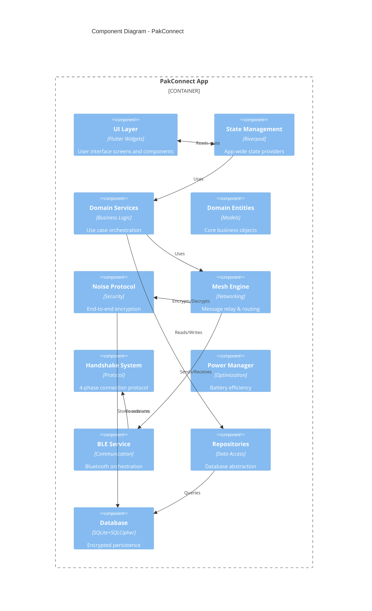
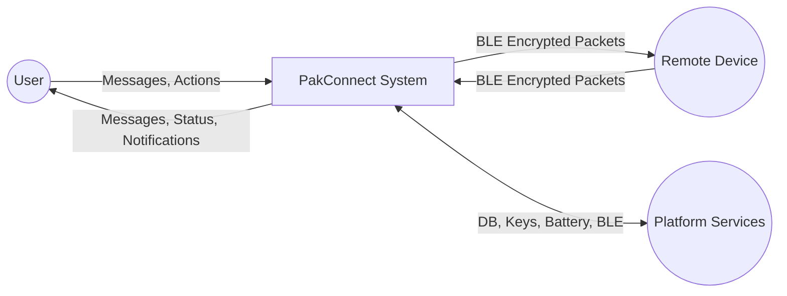
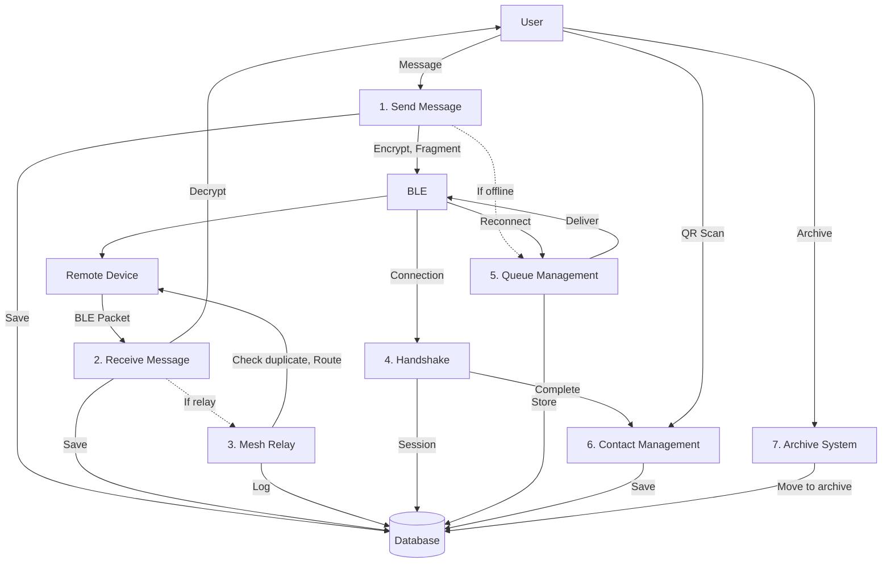
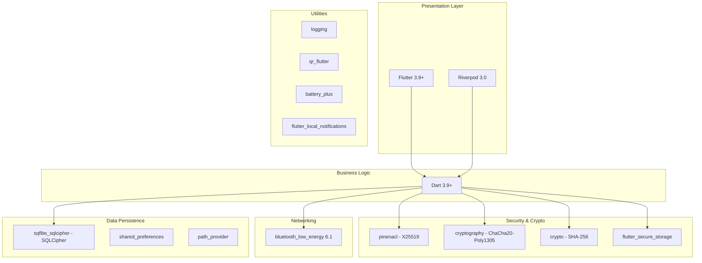

# Architecture, Component & Data Flow Diagrams Context

## Architecture Diagram: Layered Architecture

### Layer 1: Presentation Layer (`lib/presentation/`)

**Components**:
- **Screens**: `chat_screen.dart`, `home_screen.dart`, `profile_screen.dart`, `group_chat_screen.dart`, `network_topology_screen.dart`
- **Providers** (Riverpod): `ble_providers.dart`, `mesh_networking_provider.dart`, `contact_provider.dart`, `group_providers.dart`
- **Widgets**: Reusable UI components

**Responsibilities**:
- User interface rendering
- User input handling
- State management (Riverpod providers)
- UI event handling

**Dependencies**: Domain Layer services

---

### Layer 2: Domain Layer (`lib/domain/`)

**Components**:
- **Services**: `mesh_networking_service.dart`, `contact_management_service.dart`, `chat_management_service.dart`, `group_messaging_service.dart`, `archive_management_service.dart`, `notification_service.dart`
- **Entities**: `message.dart`, `enhanced_message.dart`, `contact.dart`, `chat_list_item.dart`, `archived_message.dart`

**Responsibilities**:
- Business logic orchestration
- Use case implementation
- Entity definitions
- Service coordination

**Dependencies**: Core Layer + Data Layer

---

### Layer 3: Core Layer (`lib/core/`)

**Subsystems**:

**A. Security** (`lib/core/security/`)
- `noise/` - Noise Protocol implementation
  - `noise_encryption_service.dart`
  - `noise_session_manager.dart`
  - `noise_session.dart`
  - `primitives/` - DHState, CipherState, HandshakeState
- `security_manager.dart` - Security level management
- `ephemeral_key_manager.dart` - Key rotation

**B. Messaging** (`lib/core/messaging/`)
- `mesh_relay_engine.dart` - Message relay logic
- `offline_message_queue.dart` - Queue management
- `message_router.dart` - Routing decisions
- `relay_policy.dart` - Relay configuration
- `gossip_sync_manager.dart` - Network sync

**C. Bluetooth** (`lib/core/bluetooth/`)
- `handshake_coordinator.dart` - 4-phase handshake
- `peripheral_initializer.dart` - Advertising
- `smart_handshake_manager.dart` - Connection management

**D. Routing** (`lib/core/routing/`)
- `smart_mesh_router.dart` - Intelligent routing
- `route_calculator.dart` - Path computation
- `network_topology_analyzer.dart` - Network analysis
- `connection_quality_monitor.dart` - Link quality

**E. Power** (`lib/core/power/`)
- `adaptive_power_manager.dart` - Power mode switching
- `battery_optimizer.dart` - Battery monitoring
- `ephemeral_power_manager.dart` - Ephemeral power states

**F. Scanning** (`lib/core/scanning/`)
- `burst_scanning_controller.dart` - Duty cycling

**G. Utilities** (`lib/core/utils/`)
- `message_fragmenter.dart` - MTU-based fragmentation
- `chat_utils.dart` - Chat ID generation
- `gcs_filter.dart` - Golomb-coded sets

**Responsibilities**:
- Infrastructure services
- Protocol implementation
- Networking logic
- Security primitives

**Dependencies**: Platform APIs (BLE, Secure Storage, Crypto libraries)

---

### Layer 4: Data Layer (`lib/data/`)

**Subsystems**:

**A. Services** (`lib/data/services/`)
- `ble_service.dart` - BLE orchestration
- `ble_connection_manager.dart` - Connection pooling
- `ble_message_handler.dart` - Message processing
- `ble_state_manager.dart` - State tracking
- `seen_message_store.dart` - Duplicate detection

**B. Repositories** (`lib/data/repositories/`)
- `contact_repository.dart` - Contact persistence
- `message_repository.dart` - Message storage
- `chats_repository.dart` - Chat management
- `group_repository.dart` - Group storage
- `archive_repository.dart` - Archive access
- `preferences_repository.dart` - Settings

**C. Database** (`lib/data/database/`)
- `database_helper.dart` - SQLite schema & migrations
- `database_encryption.dart` - SQLCipher key management
- `migration_service.dart` - Data migration
- `database_backup_service.dart` - Backup/restore

**Responsibilities**:
- Data persistence (SQLite)
- BLE protocol implementation
- External service integration
- Data access patterns

**Dependencies**: Platform APIs (SQLite, BLE, File system)

---

## Component Diagram

### Mermaid Syntax

### Text Description for Diagram Tool

**Components**:

1. **UI Layer** (Presentation)
   - Provides: User interface, input handling
   - Consumes: State from Providers
   - Technology: Flutter widgets

2. **State Management** (Riverpod)
   - Provides: Global state, reactive updates
   - Consumes: Domain services
   - Technology: Riverpod 3.0

3. **Domain Services**
   - Provides: Business logic APIs
   - Consumes: Core services + Repositories
   - Examples: MeshNetworkingService, ContactManagementService

4. **Noise Protocol**
   - Provides: Encryption, decryption, handshake
   - Consumes: Crypto libraries (pinenacl, cryptography)
   - Technology: X25519 + ChaCha20-Poly1305

5. **Mesh Engine**
   - Provides: Relay decisions, routing, duplicate detection
   - Consumes: Noise Protocol, BLE Service
   - Components: MeshRelayEngine, SmartMeshRouter

6. **BLE Service**
   - Provides: Bluetooth communication
   - Consumes: Platform BLE APIs
   - Components: BLEConnectionManager, BLEMessageHandler

7. **Repositories**
   - Provides: Data access abstraction
   - Consumes: Database
   - Examples: ContactRepository, MessageRepository

8. **Database**
   - Provides: Encrypted persistence
   - Technology: SQLite + SQLCipher
   - Schema: 17 tables, 9 versions

**Connectors**:
- UI ↔ Providers: Bidirectional (read state, trigger actions)
- Providers → Domain Services: Unidirectional (call methods)
- Domain Services → Core: Unidirectional (orchestration)
- Core → Data: Unidirectional (persistence)
- Mesh ↔ BLE: Bidirectional (send/receive messages)

---

## Data Flow Diagram (Level 0: Context)

### External Entities
1. **User** - Person using the app
2. **Remote Device** - Another PakConnect instance via BLE
3. **Platform Services** - OS (BLE, Secure Storage, File System)

### System: PakConnect

**Data Flows**:

**User → PakConnect**:
- Message content
- Contact actions (add, delete, verify)
- Chat actions (archive, pin, delete)
- Configuration settings

**PakConnect → User**:
- Received messages
- Message status updates
- Notifications
- Contact list
- Chat history

**Remote Device → PakConnect (via BLE)**:
- Encrypted message packets
- Handshake messages (XX/KK patterns)
- Relay messages
- Queue sync requests

**PakConnect → Remote Device (via BLE)**:
- Encrypted message packets
- Handshake responses
- Relay forwarding
- Queue sync responses

**PakConnect ↔ Platform Services**:
- Read/Write: Encrypted database (SQLCipher)
- Read/Write: Secure key storage
- Read: Battery level
- Read/Write: BLE adapter state
- Send: BLE advertisements
- Receive: BLE scan results

### Mermaid Syntax

---

## Data Flow Diagram (Level 1: Major Processes)

### Process 1: Send Message
**Inputs**: Message content (from User), Recipient key (from User)
**Outputs**: Encrypted BLE packet (to Remote Device), Message record (to Database)
**Sub-processes**:
1.1. Encrypt with Noise session
1.2. Fragment if > MTU
1.3. Queue if recipient offline
1.4. Transmit via BLE

### Process 2: Receive Message
**Inputs**: BLE packet (from Remote Device)
**Outputs**: Plaintext message (to User), Message record (to Database)
**Sub-processes**:
2.1. Reassemble fragments
2.2. Decrypt with Noise session
2.3. Check if relay required
2.4. Save to database

### Process 3: Mesh Relay
**Inputs**: Relay message (from Remote Device)
**Outputs**: Forwarded packet (to Remote Device), Relay decision log
**Sub-processes**:
3.1. Check duplicate (SeenMessageStore)
3.2. Determine next hop (SmartMeshRouter)
3.3. Re-encrypt for next hop
3.4. Forward message

### Process 4: Handshake
**Inputs**: Connection event (from Platform), Remote public key
**Outputs**: Established Noise session, Contact record (to Database)
**Sub-processes**:
4.1. Phase 0: MTU negotiation
4.2. Phase 1: Identity exchange
4.3. Phase 1.5: Noise handshake (XX/KK)
4.4. Phase 2: Security sync

### Process 5: Queue Management
**Inputs**: Offline message (from Send Message), Connection event (from Platform)
**Outputs**: Queued message record (to Database), Retry attempts (to BLE)
**Sub-processes**:
5.1. Persist to queue table
5.2. Calculate exponential backoff
5.3. Monitor connection status
5.4. Deliver on reconnection

### Process 6: Contact Management
**Inputs**: QR code data (from User), Handshake completion (from Process 4)
**Outputs**: Contact record (to Database), Updated UI (to User)
**Sub-processes**:
6.1. Parse QR data
6.2. Initiate handshake
6.3. Save contact details
6.4. Update security level

### Process 7: Archive System
**Inputs**: Archive request (from User), Auto-archive policy (scheduled)
**Outputs**: Archived chat record (to Database), Freed active storage
**Sub-processes**:
7.1. Select messages for archive
7.2. Optionally compress
7.3. Move to archive table
7.4. Update FTS5 index

### Mermaid Syntax

---

## Technology Stack Diagram

### Mermaid Syntax

---

**Document Coverage**: Architecture, Component, Data Flow
**Abstraction Levels**: Context (Level 0), Major Processes (Level 1)
**Last Updated**: 2025-01-19
