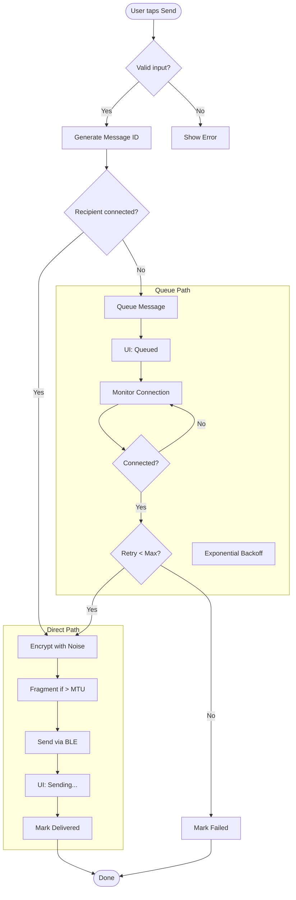
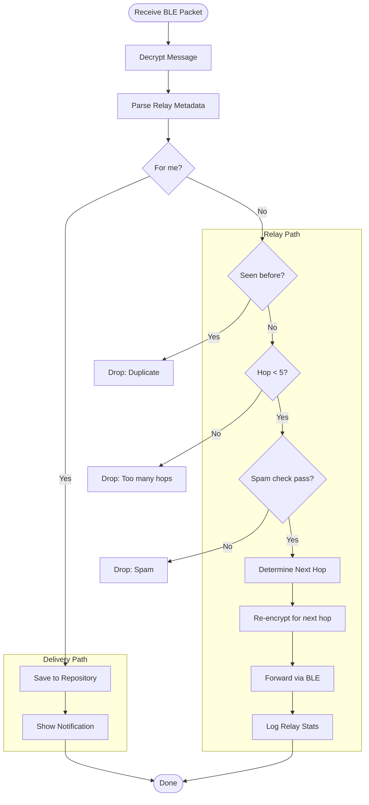
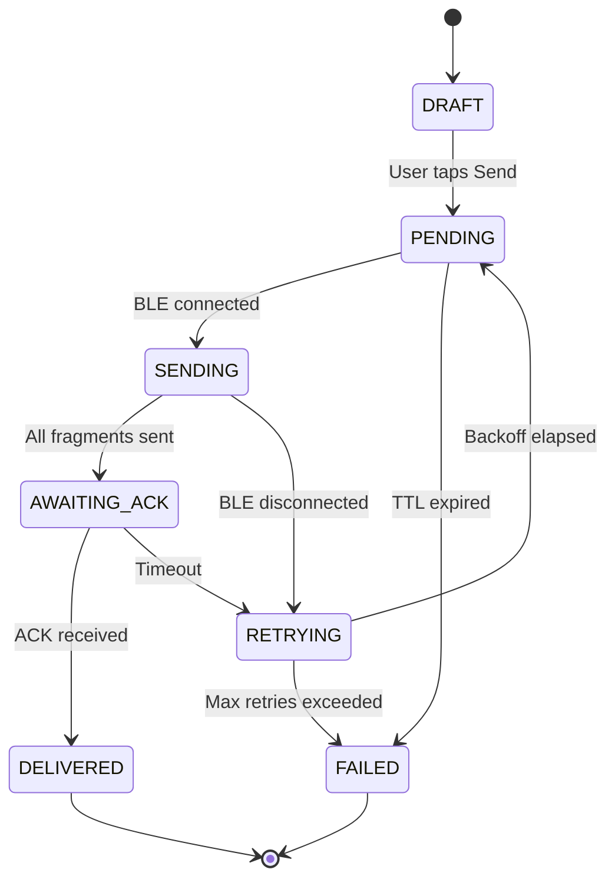
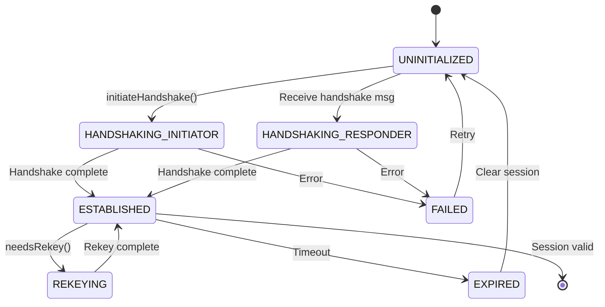
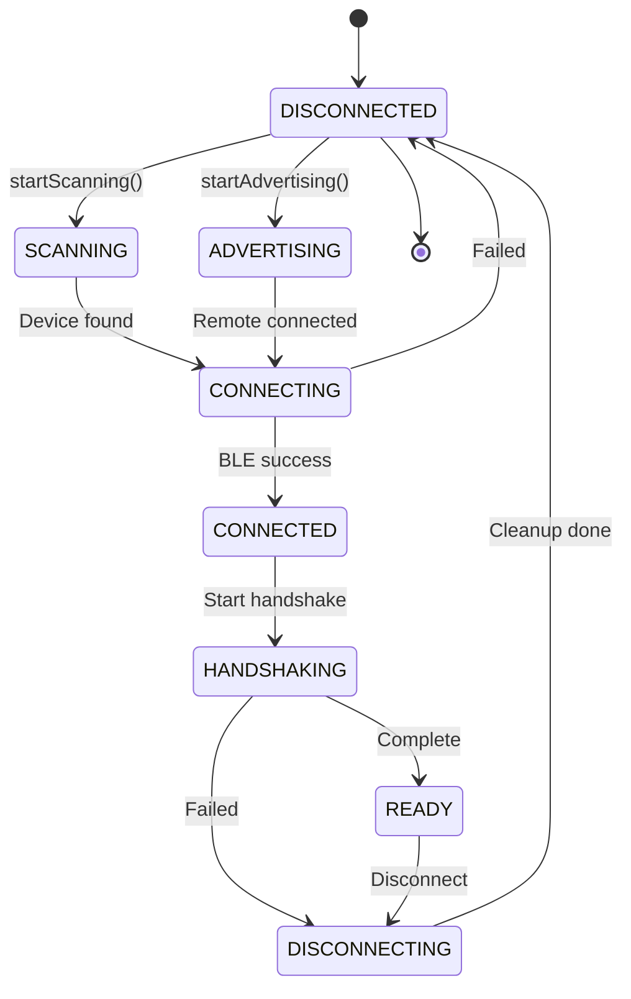

# Activity & State Machine Diagrams Context

## Activity Diagram 1: Send Message Flow

### Activities

**Start**: User taps Send button

1. **Validate Input**
   - Check message not empty
   - Check contact exists
   - Decision: Valid? → Yes: Continue, No: Show error

2. **Generate Message ID**
   - Create timestamp-based ID
   - Calculate SHA-256 hash

3. **Check Recipient Status**
   - Query BLE connection status
   - Decision: Connected? → Yes: Direct, No: Queue

**Path A: Direct Delivery**

4A. **Encrypt Message**
   - Get Noise session
   - Call encrypt() with ChaCha20-Poly1305

5A. **Fragment Message**
   - Check size vs MTU
   - Split if necessary

6A. **Send via BLE**
   - Write to characteristic
   - Fork: Parallel wait for ACK

7A. **Update UI**
   - Show "Sending..."
   - Wait for delivery confirmation
   - Join: Merge after ACK received

8A. **Mark Delivered**
   - Update message status
   - Save to repository
   - Show "Delivered"

**Path B: Queue for Later**

4B. **Queue Message**
   - Save to offline_message_queue table
   - Set status = PENDING
   - Calculate nextRetryAt

5B. **Update UI**
   - Show "Queued"

6B. **Background: Monitor Connection**
   - Loop: Check connection every 30s
   - Decision: Connected? → Yes: Attempt send, No: Continue loop

7B. **Retry with Backoff**
   - Increment retryCount
   - Calculate exponential backoff
   - Decision: retryCount < maxRetries? → Yes: Retry, No: Mark failed

**End**: Message delivered or failed

### Mermaid Syntax



---

## Activity Diagram 2: Mesh Relay Flow

### Activities

**Start**: Receive BLE packet

1. **Decrypt Message**
   - Get Noise session for sender
   - Decrypt with ChaCha20-Poly1305

2. **Parse Relay Metadata**
   - Extract hopCount, finalRecipient, originalSender

3. **Check if for Self**
   - Decision: finalRecipient == myPublicKey?
   - Yes → Go to Delivery path
   - No → Go to Relay path

**Path A: Deliver to Self**

4A. **Save to Repository**
   - Insert into messages table
   - Set isFromMe = false

5A. **Notify User**
   - Show notification
   - Update chat list

**Path B: Relay to Next Hop**

4B. **Check Duplicate**
   - Query SeenMessageStore
   - Decision: Already seen?
   - Yes → Drop message
   - No → Continue

5B. **Check Hop Limit**
   - Decision: hopCount < maxHops (5)?
   - Yes → Continue
   - No → Drop message

6B. **Check Spam Rules**
   - Query SpamPreventionManager
   - Decision: Should relay?
   - Yes → Continue
   - No → Drop message

7B. **Determine Next Hop**
   - Call SmartMeshRouter.determineOptimalRoute()
   - Use topology analysis
   - Use connection quality scores

8B. **Re-encrypt**
   - Get Noise session for next hop
   - Encrypt message

9B. **Forward Message**
   - Increment hopCount
   - Send via BLE

10B. **Log Relay**
   - Update relay statistics
   - Mark message as seen

**End**: Message delivered or dropped

### Mermaid Syntax



---

## Activity Diagram 3: Handshake (XX Pattern)

### Activities

**Start**: Device A scans, finds Device B

1. **Initiate Connection**
   - Device A connects to Device B
   - Negotiate MTU

2. **Phase 1: Identity Exchange**
   - Device A sends ephemeralId, displayName, staticPublicKey
   - Device B receives, validates
   - Device B responds with own identity

3. **Phase 1.5: Noise Handshake XX**
   - **Message 1**: Device A → Device B: `e` (32 bytes)
   - Device B receives, creates HandshakeState
   - **Message 2**: Device B → Device A: `e, ee, s, es` (96 bytes)
   - Device A receives, extracts remote static key
   - **Message 3**: Device A → Device B: `s, se` (48 bytes)
   - Device B receives, extracts remote static key
   - Both devices call Split() → Generate CipherStates

4. **Phase 2: Contact Status Sync**
   - Exchange securityLevel, trustStatus
   - Exchange lastSeen timestamps

5. **Save Contact**
   - Store contact in database
   - Store Noise session state

6. **Session Established**
   - Emit sessionEstablished event
   - Update UI

**End**: Ready for encrypted messaging

### Mermaid Syntax

```mermaid
flowchart TD
    Start([Scan & Connect])
    MTU[Negotiate MTU]

    subgraph Phase 1
        SendID_A[A → B: Identity]
        RecvID_B[B: Receive & Validate]
        SendID_B[B → A: Identity]
    end

    subgraph Phase 1.5 Noise XX
        Msg1[A → B: e]
        CreateHS_B[B: Create HandshakeState]
        Msg2[B → A: e, ee, s, es]
        ExtractKey_A[A: Extract remote static key]
        Msg3[A → B: s, se]
        ExtractKey_B[B: Extract remote static key]
        Split[Both: Split() → CipherStates]
    end

    subgraph Phase 2
        Sync[Exchange Security Status]
    end

    Save[Save Contact & Session]
    Established[Session Established]

    Start --> MTU
    MTU --> SendID_A --> RecvID_B --> SendID_B
    SendID_B --> Msg1 --> CreateHS_B --> Msg2
    Msg2 --> ExtractKey_A --> Msg3
    Msg3 --> ExtractKey_B --> Split
    Split --> Sync --> Save --> Established
    Established --> End([Ready for Messaging])
```

---

## State Machine Diagram 1: Message Status

### States

1. **DRAFT** (initial)
   - User typing message
   - Not yet queued

2. **PENDING**
   - Queued for delivery
   - Waiting for BLE connection

3. **SENDING**
   - Actively transmitting via BLE
   - Fragments being sent

4. **AWAITING_ACK**
   - All fragments sent
   - Waiting for delivery confirmation

5. **DELIVERED** (final success)
   - Confirmed delivered to recipient
   - Saved to permanent storage

6. **RETRYING**
   - Failed attempt
   - Will retry with backoff

7. **FAILED** (final failure)
   - Max retries exceeded
   - Marked as permanently failed

### Transitions

- **DRAFT → PENDING**: User taps Send
- **PENDING → SENDING**: BLE connection available
- **SENDING → AWAITING_ACK**: All fragments sent
- **AWAITING_ACK → DELIVERED**: ACK received
- **AWAITING_ACK → RETRYING**: Timeout, no ACK
- **RETRYING → PENDING**: Backoff elapsed
- **RETRYING → FAILED**: retryCount >= maxRetries
- **PENDING → FAILED**: Expired (TTL exceeded)
- **SENDING → RETRYING**: BLE disconnection during send

### Mermaid Syntax



---

## State Machine Diagram 2: Noise Session State

### States

1. **UNINITIALIZED** (initial)
   - No session exists
   - No handshake started

2. **HANDSHAKING_INITIATOR**
   - Local device initiated handshake
   - Waiting for responses

3. **HANDSHAKING_RESPONDER**
   - Remote device initiated
   - Responding to handshake messages

4. **ESTABLISHED** (stable)
   - Handshake complete
   - CipherStates ready
   - Can encrypt/decrypt

5. **REKEYING**
   - Session needs rekey (10k messages or 1 hour)
   - Performing new handshake while maintaining old

6. **FAILED** (error)
   - Handshake failed
   - Invalid messages received

7. **EXPIRED**
   - Session timeout
   - Requires new handshake

### Transitions

- **UNINITIALIZED → HANDSHAKING_INITIATOR**: initiateHandshake() called
- **UNINITIALIZED → HANDSHAKING_RESPONDER**: First handshake message received
- **HANDSHAKING_INITIATOR → ESTABLISHED**: Final handshake message processed, Split() success
- **HANDSHAKING_RESPONDER → ESTABLISHED**: Final handshake message sent, Split() success
- **HANDSHAKING_* → FAILED**: Invalid message, decryption error, or verification failure
- **ESTABLISHED → REKEYING**: needsRekey() returns true
- **REKEYING → ESTABLISHED**: Rekey handshake complete
- **ESTABLISHED → EXPIRED**: Timeout (1 hour idle)
- **FAILED → UNINITIALIZED**: Session removed, retry handshake
- **EXPIRED → UNINITIALIZED**: Session cleared

### Mermaid Syntax



---

## State Machine Diagram 3: BLE Connection State

### States

1. **DISCONNECTED** (initial)
   - No active BLE connection
   - Not scanning or advertising

2. **SCANNING**
   - Central mode active
   - Searching for devices

3. **ADVERTISING**
   - Peripheral mode active
   - Broadcasting ephemeral ID

4. **CONNECTING**
   - Connection attempt in progress
   - MTU negotiation

5. **CONNECTED**
   - Physical BLE connection established
   - Characteristics discovered

6. **HANDSHAKING**
   - Running 4-phase handshake
   - Noise protocol exchange

7. **READY**
   - Handshake complete
   - Can send/receive messages

8. **DISCONNECTING**
   - Graceful disconnect in progress
   - Cleanup operations

### Transitions

- **DISCONNECTED → SCANNING**: startScanning() called
- **DISCONNECTED → ADVERTISING**: startAdvertising() called
- **SCANNING → CONNECTING**: Device found, connect initiated
- **ADVERTISING → CONNECTING**: Remote device connected
- **CONNECTING → CONNECTED**: BLE connection success
- **CONNECTING → DISCONNECTED**: Connection failed
- **CONNECTED → HANDSHAKING**: Start 4-phase handshake
- **HANDSHAKING → READY**: Handshake complete
- **HANDSHAKING → DISCONNECTING**: Handshake failed/timeout
- **READY → DISCONNECTING**: disconnect() called or BLE error
- **DISCONNECTING → DISCONNECTED**: Cleanup complete

### Mermaid Syntax



---

**Total Activity Diagrams**: 3 major flows
**Total State Machines**: 3 critical states
**Last Updated**: 2025-01-19
