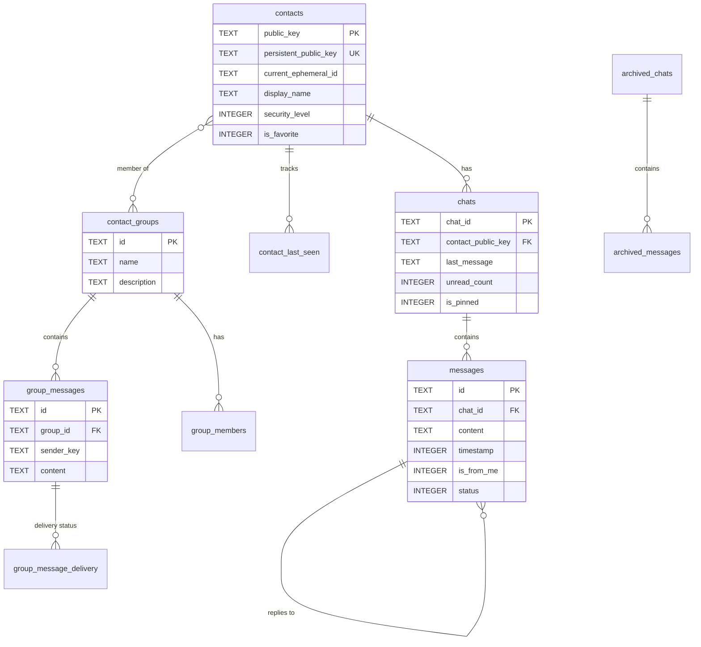

# Database Schema Documentation

## Overview

**Database**: `pak_connect.db`
**Version**: 9
**Type**: SQLite 3 with SQLCipher encryption
**Encryption**: AES-256-CBC
**Journal Mode**: WAL (Write-Ahead Logging)
**Foreign Keys**: Enabled
**Total Tables**: 17 core tables + 1 FTS5 virtual table

---

## ER Diagram Context

### Entity Relationships

**contacts** (1) ----< (M) **chats**
- One contact can have one chat
- Foreign Key: chats.contact_public_key → contacts.public_key

**chats** (1) ----< (M) **messages**
- One chat contains many messages
- Foreign Key: messages.chat_id → chats.chat_id
- CASCADE DELETE

**messages** (1) ----< (M) **messages** (self-referencing)
- Messages can reply to other messages
- Foreign Key: messages.reply_to_message_id → messages.id

**contacts** (1) ----< (M) **contact_last_seen**
- One contact has one last_seen record
- Foreign Key: contact_last_seen.public_key → contacts.public_key
- CASCADE DELETE

**archived_chats** (1) ----< (M) **archived_messages**
- One archived chat contains many archived messages
- Foreign Key: archived_messages.archive_id → archived_chats.archive_id
- CASCADE DELETE

**contact_groups** (1) ----< (M) **group_members** (M) >---- (1) **contacts**
- Many-to-many relationship via junction table
- Foreign Keys:
  - group_members.group_id → contact_groups.id (CASCADE DELETE)
  - group_members.member_key → implicit contacts lookup

**contact_groups** (1) ----< (M) **group_messages**
- One group contains many messages
- Foreign Key: group_messages.group_id → contact_groups.id (CASCADE DELETE)

**group_messages** (1) ----< (M) **group_message_delivery**
- One group message has many delivery records (one per member)
- Foreign Key: group_message_delivery.message_id → group_messages.id (CASCADE DELETE)

---

## Table Details

### 1. contacts

**Purpose**: Store contact information with three-ID model

**Schema**:
```sql
CREATE TABLE contacts (
  public_key TEXT PRIMARY KEY,              -- Immutable first contact ID
  persistent_public_key TEXT UNIQUE,         -- MEDIUM+ security real identity
  current_ephemeral_id TEXT,                 -- Active Noise session ID
  ephemeral_id TEXT,                         -- DEPRECATED (use current_ephemeral_id)
  display_name TEXT NOT NULL,
  trust_status INTEGER NOT NULL,
  security_level INTEGER NOT NULL,           -- 0=LOW, 1=MEDIUM, 2=HIGH
  first_seen INTEGER NOT NULL,
  last_seen INTEGER NOT NULL,
  last_security_sync INTEGER,
  noise_public_key TEXT,                     -- For Noise sessions
  noise_session_state TEXT,                  -- Serialized session state
  last_handshake_time INTEGER,
  is_favorite INTEGER DEFAULT 0,
  created_at INTEGER NOT NULL,
  updated_at INTEGER NOT NULL
);
```

**Indexes**:
- `idx_contacts_trust` ON (trust_status)
- `idx_contacts_security` ON (security_level)
- `idx_contacts_last_seen` ON (last_seen DESC)
- `idx_contacts_favorite` ON (is_favorite) WHERE is_favorite = 1
- `idx_contacts_persistent_key` ON (persistent_public_key) WHERE persistent_public_key IS NOT NULL

**Constraints**:
- PRIMARY KEY: public_key
- UNIQUE: persistent_public_key

---

### 2. chats

**Purpose**: Chat list with metadata

**Schema**:
```sql
CREATE TABLE chats (
  chat_id TEXT PRIMARY KEY,
  contact_public_key TEXT,
  contact_name TEXT NOT NULL,
  last_message TEXT,
  last_message_time INTEGER,
  unread_count INTEGER DEFAULT 0,
  is_archived INTEGER DEFAULT 0,
  is_muted INTEGER DEFAULT 0,
  is_pinned INTEGER DEFAULT 0,
  created_at INTEGER NOT NULL,
  updated_at INTEGER NOT NULL,
  FOREIGN KEY (contact_public_key) REFERENCES contacts(public_key) ON DELETE SET NULL
);
```

**Indexes**:
- `idx_chats_contact` ON (contact_public_key)
- `idx_chats_last_message` ON (last_message_time DESC)
- `idx_chats_unread` ON (unread_count) WHERE unread_count > 0
- `idx_chats_pinned` ON (is_pinned, last_message_time DESC) WHERE is_pinned = 1

**Constraints**:
- PRIMARY KEY: chat_id
- FOREIGN KEY: contact_public_key → contacts.public_key (SET NULL on delete)

---

### 3. messages

**Purpose**: Message history with enhanced features

**Schema**:
```sql
CREATE TABLE messages (
  id TEXT PRIMARY KEY,
  chat_id TEXT NOT NULL,
  content TEXT NOT NULL,
  timestamp INTEGER NOT NULL,
  is_from_me INTEGER NOT NULL,
  status INTEGER NOT NULL,                   -- 0=pending, 1=sent, 2=delivered, 3=read, 4=failed

  -- Threading
  reply_to_message_id TEXT,
  thread_id TEXT,

  -- Status flags
  is_starred INTEGER DEFAULT 0,
  is_forwarded INTEGER DEFAULT 0,
  priority INTEGER DEFAULT 1,

  -- Edit tracking
  edited_at INTEGER,
  original_content TEXT,

  -- Media support
  has_media INTEGER DEFAULT 0,
  media_type TEXT,

  -- Complex objects as JSON blobs
  metadata_json TEXT,
  delivery_receipt_json TEXT,
  read_receipt_json TEXT,
  reactions_json TEXT,
  attachments_json TEXT,
  encryption_info_json TEXT,

  -- Timestamps
  created_at INTEGER NOT NULL,
  updated_at INTEGER NOT NULL,

  FOREIGN KEY (chat_id) REFERENCES chats(chat_id) ON DELETE CASCADE
);
```

**Indexes**:
- `idx_messages_chat_time` ON (chat_id, timestamp DESC)
- `idx_messages_thread` ON (thread_id) WHERE thread_id IS NOT NULL
- `idx_messages_reply` ON (reply_to_message_id) WHERE reply_to_message_id IS NOT NULL
- `idx_messages_starred` ON (is_starred) WHERE is_starred = 1
- `idx_messages_media` ON (chat_id, has_media) WHERE has_media = 1

**Constraints**:
- PRIMARY KEY: id
- FOREIGN KEY: chat_id → chats.chat_id (CASCADE delete)

---

### 4. offline_message_queue

**Purpose**: Persistent queue for offline recipients (CRITICAL for mesh)

**Schema**:
```sql
CREATE TABLE offline_message_queue (
  queue_id TEXT PRIMARY KEY,
  message_id TEXT NOT NULL,
  chat_id TEXT NOT NULL,
  content TEXT NOT NULL,
  recipient_public_key TEXT NOT NULL,
  sender_public_key TEXT NOT NULL,

  -- Queue metadata
  queued_at INTEGER NOT NULL,
  retry_count INTEGER DEFAULT 0,
  max_retries INTEGER DEFAULT 5,
  next_retry_at INTEGER,
  priority INTEGER DEFAULT 1,

  -- Delivery tracking
  status INTEGER NOT NULL,                   -- 0=pending, 1=sending, 2=delivered, 3=failed, 4=retrying
  attempts INTEGER DEFAULT 0,
  last_attempt_at INTEGER,
  delivered_at INTEGER,
  failed_at INTEGER,
  failure_reason TEXT,
  expires_at INTEGER,

  -- Relay metadata (for mesh networking)
  is_relay_message INTEGER DEFAULT 0,
  original_message_id TEXT,
  relay_node_id TEXT,
  message_hash TEXT,
  relay_metadata_json TEXT,

  -- Additional fields
  reply_to_message_id TEXT,
  attachments_json TEXT,
  sender_rate_count INTEGER DEFAULT 0,

  created_at INTEGER NOT NULL,
  updated_at INTEGER NOT NULL
);
```

**Indexes**:
- `idx_queue_status` ON (status, next_retry_at)
- `idx_queue_recipient` ON (recipient_public_key, status)
- `idx_queue_priority` ON (priority DESC, queued_at ASC)
- `idx_queue_hash` ON (message_hash) WHERE message_hash IS NOT NULL

**Constraints**:
- PRIMARY KEY: queue_id

---

### 5. queue_sync_state

**Purpose**: Track queue synchronization between devices

**Schema**:
```sql
CREATE TABLE queue_sync_state (
  device_id TEXT PRIMARY KEY,
  last_sync_at INTEGER,
  pending_messages_count INTEGER DEFAULT 0,
  last_successful_delivery INTEGER,
  consecutive_failures INTEGER DEFAULT 0,
  sync_enabled INTEGER DEFAULT 1,
  metadata_json TEXT,
  updated_at INTEGER NOT NULL
);
```

**Indexes**:
- `idx_sync_pending` ON (pending_messages_count) WHERE pending_messages_count > 0

---

### 6. deleted_message_ids

**Purpose**: Track deleted messages for queue sync (prevent redelivery)

**Schema**:
```sql
CREATE TABLE deleted_message_ids (
  message_id TEXT PRIMARY KEY,
  deleted_at INTEGER NOT NULL,
  reason TEXT
);
```

**Indexes**:
- `idx_deleted_time` ON (deleted_at)

---

### 7. archived_chats

**Purpose**: Archive metadata for archived conversations

**Schema**:
```sql
CREATE TABLE archived_chats (
  archive_id TEXT PRIMARY KEY,
  original_chat_id TEXT NOT NULL,
  contact_name TEXT NOT NULL,
  contact_public_key TEXT,
  archived_at INTEGER NOT NULL,
  last_message_time INTEGER,
  message_count INTEGER NOT NULL,

  -- Archive metadata
  archive_reason TEXT,
  estimated_size INTEGER NOT NULL,
  is_compressed INTEGER DEFAULT 0,
  compression_ratio REAL,

  -- Metadata as JSON
  metadata_json TEXT,
  compression_info_json TEXT,
  custom_data_json TEXT,

  created_at INTEGER NOT NULL,
  updated_at INTEGER NOT NULL
);
```

**Indexes**:
- `idx_archived_chats_time` ON (archived_at DESC)
- `idx_archived_chats_contact` ON (contact_public_key)

---

### 8. archived_messages

**Purpose**: Archived message storage with full-text search support

**Schema**:
```sql
CREATE TABLE archived_messages (
  id TEXT PRIMARY KEY,
  archive_id TEXT NOT NULL,
  original_message_id TEXT NOT NULL,
  chat_id TEXT NOT NULL,

  -- Basic message fields
  content TEXT NOT NULL,
  timestamp INTEGER NOT NULL,
  is_from_me INTEGER NOT NULL,
  status INTEGER NOT NULL,

  -- Enhanced fields
  reply_to_message_id TEXT,
  thread_id TEXT,
  is_starred INTEGER DEFAULT 0,
  is_forwarded INTEGER DEFAULT 0,
  priority INTEGER DEFAULT 1,
  edited_at INTEGER,
  original_content TEXT,
  has_media INTEGER DEFAULT 0,
  media_type TEXT,

  -- Archive-specific metadata
  archived_at INTEGER NOT NULL,
  original_timestamp INTEGER NOT NULL,

  -- Complex objects as JSON
  metadata_json TEXT,
  delivery_receipt_json TEXT,
  read_receipt_json TEXT,
  reactions_json TEXT,
  attachments_json TEXT,
  encryption_info_json TEXT,
  archive_metadata_json TEXT,
  preserved_state_json TEXT,

  -- Search optimization
  searchable_text TEXT,

  created_at INTEGER NOT NULL,

  FOREIGN KEY (archive_id) REFERENCES archived_chats(archive_id) ON DELETE CASCADE
);
```

**Indexes**:
- `idx_archived_msg_archive` ON (archive_id, timestamp)
- `idx_archived_msg_starred` ON (is_starred) WHERE is_starred = 1

---

### 9. archived_messages_fts

**Purpose**: Full-text search virtual table for archived messages

**Schema**:
```sql
CREATE VIRTUAL TABLE archived_messages_fts USING fts5(
  searchable_text,
  content=archived_messages,
  content_rowid=rowid,
  tokenize='porter unicode61'
);
```

**Triggers**: Automatically sync with archived_messages table
- `archived_msg_fts_insert` - On INSERT
- `archived_msg_fts_delete` - On DELETE
- `archived_msg_fts_update` - On UPDATE

---

### 10. device_mappings

**Purpose**: Map device UUIDs to public keys for identity tracking

**Schema**:
```sql
CREATE TABLE device_mappings (
  device_uuid TEXT PRIMARY KEY,
  public_key TEXT NOT NULL,
  last_seen INTEGER NOT NULL,
  created_at INTEGER NOT NULL,
  updated_at INTEGER NOT NULL
);
```

**Indexes**:
- `idx_device_public_key` ON (public_key)

---

### 11. contact_last_seen

**Purpose**: Online status tracking

**Schema**:
```sql
CREATE TABLE contact_last_seen (
  public_key TEXT PRIMARY KEY,
  last_seen_at INTEGER NOT NULL,
  was_online INTEGER DEFAULT 0,
  updated_at INTEGER NOT NULL,
  FOREIGN KEY (public_key) REFERENCES contacts(public_key) ON DELETE CASCADE
);
```

**Indexes**:
- `idx_last_seen_time` ON (last_seen_at DESC)

---

### 12. migration_metadata

**Purpose**: Track data migration progress from SharedPreferences → SQLite

**Schema**:
```sql
CREATE TABLE migration_metadata (
  key TEXT PRIMARY KEY,
  value TEXT,
  migrated_at INTEGER NOT NULL
);
```

---

### 13. app_preferences

**Purpose**: User settings and app configuration

**Schema**:
```sql
CREATE TABLE app_preferences (
  key TEXT PRIMARY KEY,
  value TEXT NOT NULL,
  value_type TEXT NOT NULL,          -- 'string', 'int', 'bool', 'double'
  created_at INTEGER NOT NULL,
  updated_at INTEGER NOT NULL
);
```

**Indexes**:
- `idx_preferences_type` ON (value_type)

---

### 14. contact_groups

**Purpose**: Contact group definitions for multi-unicast messaging

**Schema**:
```sql
CREATE TABLE contact_groups (
  id TEXT PRIMARY KEY,
  name TEXT NOT NULL,
  description TEXT,
  created_at INTEGER NOT NULL,
  last_modified_at INTEGER NOT NULL
);
```

**Indexes**:
- `idx_groups_modified` ON (last_modified_at DESC)

---

### 15. group_members

**Purpose**: Junction table for group membership (many-to-many)

**Schema**:
```sql
CREATE TABLE group_members (
  group_id TEXT NOT NULL,
  member_key TEXT NOT NULL,
  added_at INTEGER NOT NULL,
  PRIMARY KEY (group_id, member_key),
  FOREIGN KEY (group_id) REFERENCES contact_groups(id) ON DELETE CASCADE
);
```

**Indexes**:
- `idx_group_members_key` ON (member_key)

**Constraints**:
- COMPOSITE PRIMARY KEY: (group_id, member_key)
- FOREIGN KEY: group_id → contact_groups.id (CASCADE delete)

---

### 16. group_messages

**Purpose**: Group message storage

**Schema**:
```sql
CREATE TABLE group_messages (
  id TEXT PRIMARY KEY,
  group_id TEXT NOT NULL,
  sender_key TEXT NOT NULL,
  content TEXT NOT NULL,
  timestamp INTEGER NOT NULL,
  FOREIGN KEY (group_id) REFERENCES contact_groups(id) ON DELETE CASCADE
);
```

**Indexes**:
- `idx_group_messages_group` ON (group_id, timestamp DESC)
- `idx_group_messages_sender` ON (sender_key)

---

### 17. group_message_delivery

**Purpose**: Per-member delivery tracking for group messages

**Schema**:
```sql
CREATE TABLE group_message_delivery (
  message_id TEXT NOT NULL,
  member_key TEXT NOT NULL,
  status INTEGER NOT NULL,              -- 0=pending, 1=sent, 2=delivered, 3=failed
  timestamp INTEGER NOT NULL,
  PRIMARY KEY (message_id, member_key),
  FOREIGN KEY (message_id) REFERENCES group_messages(id) ON DELETE CASCADE
);
```

**Indexes**:
- `idx_delivery_status` ON (message_id, status)

**Constraints**:
- COMPOSITE PRIMARY KEY: (message_id, member_key)
- FOREIGN KEY: message_id → group_messages.id (CASCADE delete)

---

## Database Configuration

**PRAGMAs Applied**:
```sql
PRAGMA foreign_keys = ON;                 -- Enforce referential integrity
PRAGMA journal_mode = WAL;                 -- Write-Ahead Logging for concurrency
PRAGMA cache_size = -10000;                -- 10MB cache
```

**Encryption** (SQLCipher):
- Algorithm: AES-256-CBC
- Key Derivation: PBKDF2 with SHA-512
- Key stored in: FlutterSecureStorage

---

## Migration History

**v1 → v2**: Added `chat_id` to `archived_messages`
**v2 → v3**: Removed unused `user_preferences` table, enabled SQLCipher
**v3 → v4**: Added `app_preferences` table for settings
**v4 → v5**: Added Noise Protocol fields (`noise_public_key`, `noise_session_state`, `last_handshake_time`) to `contacts`
**v5 → v6**: Added `is_favorite` field to `contacts`
**v6 → v7**: Added `ephemeral_id` to `contacts`
**v7 → v8**: Added `persistent_public_key` and `current_ephemeral_id` to `contacts` (three-ID model)
**v8 → v9**: Added group messaging tables (`contact_groups`, `group_members`, `group_messages`, `group_message_delivery`)

---

## Mermaid ER Diagram



---

**Total Tables**: 17 + 1 FTS5
**Total Indexes**: 30+
**Total Foreign Keys**: 11
**Last Updated**: 2025-01-19
